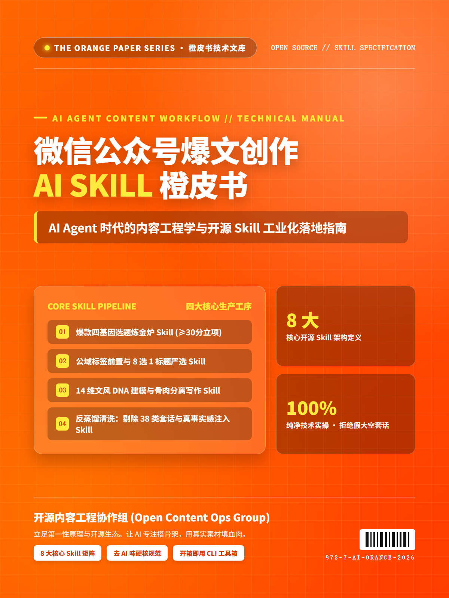

# 微信公众号爆文创作 AI Skill 橙皮书
### WeChat Viral Content Creation AI Skills & Engineering Manual

<div align="center">

<p align="center">
  
</p>

[-ff6a00?style=for-the-badge&logo=adobeacrobatreader)](wechat-viral-orange-paper.pdf)
[](LICENSE)
[](skills/)
[](skills/)
[](skills/)

</div>

> **本仓库是一套面向 AI Agent 时代“微信公众号爆文工业化生产”的开源技能库与实战工程手册。**  
> 坚决拒绝低质 AI 直出的模板套话，系统性解构搜狗文章检索、10w+ 选题炼金炉、四幕剧大纲规划、标题工程 8 选 1、14 维文风 DNA 克隆、38 类套路词反蒸馏质检，以及直通微信公众平台官方草稿箱的全自动工业流水线。

---

## 为什么需要这套开源 Skill？

自媒体自 2024 年底进入全面算法治理周期。大语言模型普及后，微信生态遭遇了海量“一键生成、全篇假大空、语言平滑对称”的批量数字垃圾（AI Slop）。平台推荐算法通过**语义指纹降维消重**、**困惑度与突发性检测**、**第一人称真实生活经历特征识别**，对此类文章实施严厉降权，完读率低于 10%，阅读量永久停留在两位数。

**AI 直出的时代已经结束，“骨架与血肉分离”的工业化协同才是唯一解法：**
- **AI 负责构筑骨架（70% 繁重体力劳动）**：敏感情报捕获、8 维选题打分、四幕剧结构规划、14 维文风量化控制、38 类套路词机器质检；
- **人类负责注入血肉（30% 核心灵魂与真实感）**：真实生活切片、具象道具细节、真实对话、主观偏见与审美决断。

---

## 8 大核心 Skill 矩阵全景速查表

全套技能组件模块化沉淀在 [`skills/`](skills/) 目录下，既支持独立的 CLI 终端调用，也原生兼容 Claude Code、Cursor、Windsurf 等主流 AI Agent 环境：

| 序号 | 技能标识 (Skill ID) | 核心定位与职责 | 技术驱动 | 关键输入 | 关键输出 |
| :--- | :--- | :--- | :--- | :--- | :--- |
| **01** | [`wechat-article-search`](skills/wechat-official-account-expert/skills/wechat-article-search/) | 搜狗微信文章精准检索与结构化提取 | Node.js / Cheerio | 关键词、时间范围、页数 | 爆文元数据列表、清洗后正文 |
| **02** | [`viral-topic-forge`](skills/viral-topic-master/skills/viral-topic-forge/) | 爆款四基因评估与 8 维量化打分卡 | LLM / 规则引擎 | 候选热点、受众画像 | 8 维打分表、立项建议（≥30分） |
| **03** | [`wechat-topic-outline-planner`](skills/wechat-official-account-expert/skills/wechat-topic-outline-planner/) | 四幕剧大纲规划与真人血肉槽位打桩 | LLM / 叙事模板 | 确立选题、目标字数 | 四幕剧大纲、3秒Hook、[填空锚点] |
| **04** | [`wechat-title-generator`](skills/wechat-official-account-expert/skills/wechat-title-generator/) | 公域推荐流标题 8 选 1 严选机制 | LLM / 拦截正则 | 核心大纲、对标案例 | 4 类维度共 8 个标题、4 大硬拦截 |
| **05** | [`wechat-style-profiler`](skills/wechat-official-account-expert/skills/wechat-style-profiler/) | 14 维文风 DNA 特征量化与克隆 | Python 3 / 统计学 | 对标大号文章语料 (≥3篇) | `style_profile.json`（句长/标点配比） |
| **06** | [`wechat-draft-writer`](skills/wechat-official-account-expert/skills/wechat-draft-writer/) | 骨肉分离合成撰写与移动端排版 | LLM / 模板引擎 | 大纲骨架、150字真人细节 | 完整正文（1~3句/段、呼吸感排版） |
| **07** | [`anti-distill & humanizer`](skills/wechat-official-account-expert/skills/anti-distill/) | 38 类套话黑名单清洗与反蒸馏质检 | Python / 改写引擎 | 文章初稿、38类违禁词库 | 污染词命中表、AI浓度打分、清洗终稿 |
| **08** | [`mp-draft-push`](skills/wechat-official-account-expert/skills/mp-draft-push/) | 微信公众平台官方草稿箱直连推送 | Python / Requests | AppID、AppSecret、HTML | 草稿箱 `media_id`、富文本内联样式 |

---

## 工业化全链路架构图 (End-to-End Pipeline)

```
[微信公域生态文章]
       │
       ▼
【Skill 1: wechat-article-search】── 搜狗微信抓取 TOP 20 爆文情报
       │
       ▼
【Skill 2: viral-topic-forge】────── 爆款四基因 + 8 维量化打分（≥30分立项）
       │
       ▼
【Skill 3: wechat-topic-outline-planner】四幕剧大纲规划 + 预留 [人类填空锚点]
       │
       ├───────────────────────────────┐
       ▼                               ▼
【人类创作者填入 150 字真实经历】   【Skill 4: wechat-title-generator】
       │                               8 选 1 公域标题严选（4 大硬拦截）
       └───────────────────────────────┤
                                       ▼
【Skill 5: wechat-style-profiler】── 14 维文风 DNA 量化注入
       │
       ▼
【Skill 6: wechat-draft-writer】──── 骨肉分离合成（移动端 1~3 句/段排版）
       │
       ▼
【Skill 7: anti-distill & humanizer】38 类套路词清洗 + AI 浓度评分（≤5%放行）
       │
       ▼
【人类创作者最终核验】
       │
       ▼
【Skill 8: mp-draft-push】────────── 官方草稿箱 API 推送（不直接群发，安全合规）
```

---

## 极简 CLI 终端快速起步

本仓库提供开箱即用的终端 CLI 脚本，无需繁琐部署即可本地运行：

### 1. 采集对标爆文情报
```bash
# 检索 AI 落地 赛道近一周的热门微信爆文
node skills/wechat-official-account-expert/skills/wechat-article-search/scripts/search_wechat.js --keyword "AI实战" --time 2 --limit 10
```

### 2. 提取对标大号 14 维文风 DNA
```bash
# 分析对标语料，输出数学量化的文风配置文件
python skills/wechat-official-account-expert/skills/wechat-style-profiler/scripts/build_style_profile.py --input corpus.txt --output style_profile.json
```

### 3. 运行去 AI 味质检拦截器
```bash
# 扫描正文草稿中的 38 类高频套路词与困惑度指标
python scripts/audit_ai_pollution.py --draft draft.md
```

### 4. 直推微信公众平台草稿箱
```bash
# 推送图文至草稿箱，并自动关联封面图
python skills/wechat-official-account-expert/skills/mp-draft-push/scripts/push_draft.py \
  --appid "YOUR_APP_ID" \
  --secret "YOUR_APP_SECRET" \
  --title "那些天天用AI写公众号的人，正在被平台批量封号限流" \
  --content draft.html \
  --thumb cover.png
```

---

## 在 AI Agent 中载入与使用 (Claude Code / Cursor / Windsurf)

本仓库的 Skill 严格遵循现代 AI Agent 标准规范，支持无缝注入主流智能体系统：

### 1. Claude Code 挂载
```bash
# 在终端中向 Claude Code 注册本技能套件
claude config add-skill D:/repos/wechat-viral-orange-paper/skills/wechat-official-account-expert
```

### 2. Cursor / Windsurf Rules 配置
在项目根目录的 `.cursorrules` 或 `.windsurfrules` 中添加以下指引：
```text
微信公众号创作遵循本仓库 skills/ 下的 8 大标准：
1. 选题必须执行 8 维打分卡（≥30分立项）；
2. 大纲采用四幕剧结构，必须设置 [人类填空锚点]；
3. 标题执行 8 选 1 并拦截冒号与破折号；
4. 正文排版严格遵守 1~3 句/段；
5. 必须经过 38 类 AI 违禁套话扫描清洗。
```

### 3. 自然语言对话调用示例
```text
用户：
"我想写一篇关于【2026年独立开发者用 Claude Code 变现】的微信文章，
帮我调取对标数据，跑完选题打分和大纲设计。"

Agent 将自动流转：
1. 调用 search_wechat 检索公域热门讨论；
2. 计算 8 维打分卡（痛点烈度 5/5，受众基数 4/5，综合得分 33 分，立项）；
3. 生成四幕剧大纲，并在故事节点插入 2 处填空锚点，提示您补充真实经历细节。
```

---

## 《橙皮书》核心手册阅读入口

想要系统性掌握完整的方法论与工程实现，推荐阅读完整的《橙皮书》：

- **[📄 docs/orange-paper.md（单文件万字完整版）](docs/orange-paper.md)**  
  包含全部 10 卷核心内容、全套代码解析、打分卡模板与 38 类套话拦截对照表。
- **[📕 wechat-viral-orange-paper.pdf（24 页精装排版完整版）](wechat-viral-orange-paper.pdf)**  
  包含由 Grok Imagine 引擎直出的纯正爱马仕橙、带有白色精装书边框的 2D 封面（著者：宇龙），支持打印与离线高品质阅读。
- **分卷阅读**：
  - [卷一：底层哲学与破局点 —— 为什么 AI 直出必死？](docs/01-architecture-philosophy.md)
  - [卷二：10w+ 爆款选题炼金炉](docs/02-viral-topic-forge.md)
  - [卷三：公域标题工程学](docs/03-title-engineering.md)
  - [卷四：14 维文风 DNA 画像提取](docs/04-style-dna-profiler.md)
  - [卷五：去 AI 味反蒸馏与人性化质检](docs/05-anti-distill-humanizer.md)
  - [卷六：工具链与自动化工程实践](docs/06-tools-and-automation.md)

---

## 开源协议与贡献指南

- 本项目基于 **[Apache License 2.0](LICENSE)** 协议开源，欢迎自由引用、二次开发与工业化集成。
- 严禁用于批量生成低质诈骗、违规谣言等侵害公众利益的内容生产。
- 欢迎提交 PR 与 Issue，共同完善更多垂直赛道的文风 DNA 模型与质检规则！
