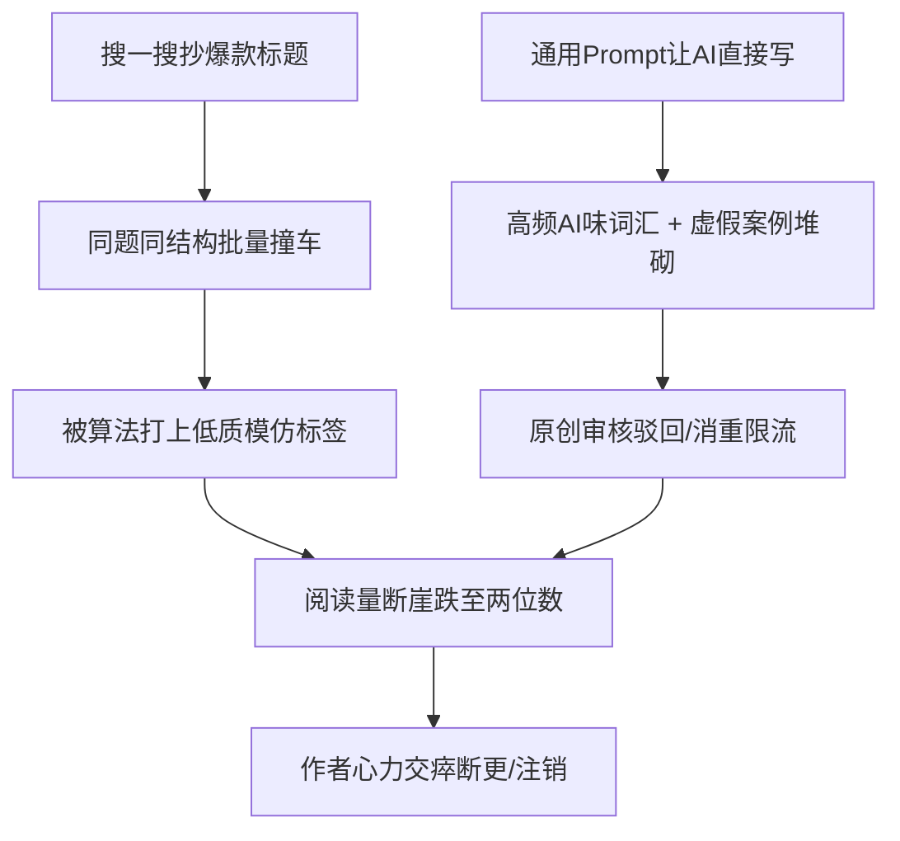
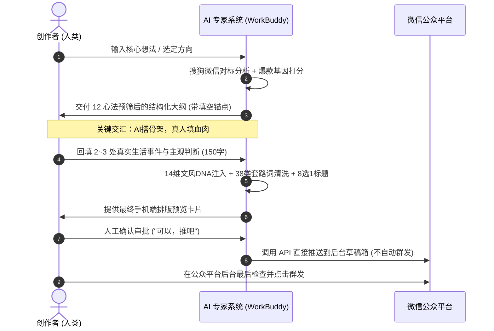

# 卷一：底层哲学与破局点 —— 为什么 AI 直出必死？

> “平台从来不反对创作者使用 AI 提高生产力，平台封杀和限流的，是没有灵魂、没有真人经历、模板化拼凑的批量数字垃圾。”

---

## 1. 行业现状与 AI 创作者的“死亡螺旋”

2024–2026 年，微信公众平台对内容生态的治理策略发生了根本性变革。随着大语言模型的普及，海量自媒体创作者陷入了同一个误区：
**“去搜一搜找爆款标题 → 丢给 AI 写一篇 1500 字 → 配两张网图 → 直接群发”**。

这种模式在当下的分发算法面前遭遇了彻底的降维打击：

### 死亡螺旋的三大根因：
1. **标题同质化撞车**：搜一搜排名前列的爆款标题已经被数百个号批量抄袭过，平台语义模型能够毫秒级聚类识别，直接归入“批量低质仿写库”。
2. **严重的“AI 味道”（AI Slop）**：未受约束的 LLM 天生携带“谄媚、宏大叙事、中立无立场、虚假对称感”的基因。如“在当今快节奏的社会中”、“不仅……更是……”、“让我们深入探讨一下”、“余生愿你……”。读者 3 秒内关闭，完读率低于 15%。
3. **真实生活经历的虚空**：平台算法新规明确强化了**真人实名经历特征识别**。缺乏真实生活细节（具体时间、人名、对话、数字、心理活动）的文章，无法建立读者信任与情感共鸣。

---

## 2. 破局之道：“骨架与血肉分离”的工业化范式

WorkBuddy 专家系统之所以能够持续产出爆文，核心在于彻底抛弃了“让 AI 全包代笔”的幻想，确立了**“AI 搭骨架，真人填血肉”**的共创工业化流程：

### 核心分工原则表

| 创作环节 | AI 负责什么（长板） | 人类创作者负责什么（底线） |
|---|---|---|
| **选题与切入** | 扫描全网热点、做 8 维价值打分、提供 3 个反常识切入角度 | 决定写哪个、判断是否契合自身受众与人设 |
| **框架与节奏** | 搭建起承转合骨架、设计每段字数（<25字单句）、安排高潮点 | 提供真实发生过的生活细节、具体数字、真实对话 |
| **正文初稿** | 依据文风 DNA 组装语言、阐释概念、推导逻辑链条 | 审核事实准确性、确认是否像“自己口吻说出来的” |
| **去 AI 味** | 运行硬性质检脚本，自动替换 38 类套路连词与陈词滥调 | 注入主观情绪偏见、半成品想法、口语断句留白 |
| **排版与发布** | 自动生成内联样式 HTML、生成对应封面图、直推草稿箱 | 最终点击群发，保持账号安全与合规把控 |

---

## 3. 爆款公众号的底层商业闭环

爆款文章不是目的，**健康稳定的流量主收益与私域沉淀**才是终局。

根据 548 篇爆款公众号的真实体检数据：
- **篇幅最佳区间**：`900 - 1200` 字（手机屏幕 3~4 屏，既满足当下读者碎片化耐心，又达到文中插入 2 条广告的字数门槛）。
- **生命周期规律**：微信生态中，爆文在发布后 2 小时完成公域种子池冷启动，24~48 小时由推荐算法放大。一旦单篇突破千读进大池，必须在 48 小时内同系列、同结构快速连推 2 篇进行“命中放大”。
- **单号与多号矩阵分工**：
  - **主号（流量主号）**：追求大众痛点、情绪共鸣、认知反转、高频日更，赚取流量主广告。
  - **副号（个人 IP / 转化号）**：深度私域沉淀、真实日常疗愈、高净值服务转化。
