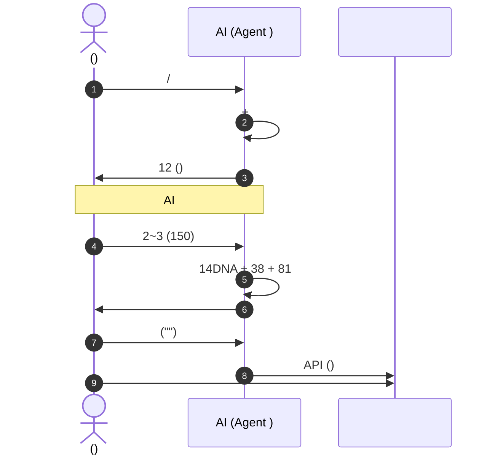

# —— AI 

> “ AI ”

---

## 1. AI “”

2024–2026 
**“ → AI 1500 → → ”**


```mermaid
graph TD
 A[] --> B[]
 B --> C[]
 D[PromptAI] --> E[AI + ]
 E --> F[/]
 C & F --> G[]
 G --> H[/]
```

### 1. ****“”
2. **“AI ”AI Slop** LLM “”“”“…………”“”“……” 3 15%
3. ********

---

## 2. “”

 Agent “ AI ”**“AI ”**



### | | AI | |
|---|---|---|
| **** | 8 3 | |
| **** | <25 | |
| **** | DNA | “” |
| ** AI ** | 38 | |
| **** | HTML | |

---

## 3. 

****

 548 
- ****`900 - 1200` 3~4 2 
- **** 2 24~48 48 2 “”
- ****
 - ****
 - ** IP / **
