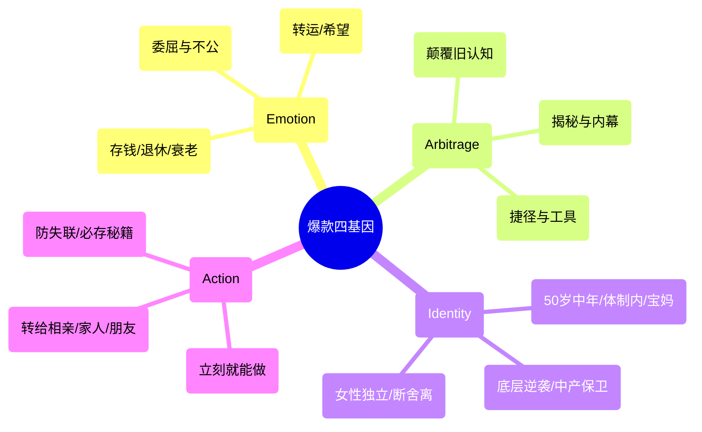

# 卷二：选题工程 —— 10w+ 爆款选题炼金炉 (Viral Topic Forge)

> “选题决定了一篇文章 80% 的阅读上限。写所有人都在经历的心事，不写只有自己关心的私事。”

---

## 1. 爆款四基因模型 (The Four Genes)

任何能够穿透圈层、引发病毒式转发的公众号内容，背后必然具备以下四种底层基因中的至少两项：



1. **情绪共鸣（Emotion）**：激发生理层面的情绪反应（愤怒、释怀、庆幸、危机感）。读者转发不是因为文章写得好，而是借文章说出自己想说却不敢说的话。
2. **信息差认知（Arbitrage）**：打破“常识谬误”。例如“人越节俭越穷”、“努力工作是最慢的赚钱方式”。提供高于读者日常视角的认知杠杆。
3. **身份认同（Identity）**：精准锚定群体。如“35岁裸辞”、“退休阿姨”、“月薪3000打工人”。给读者贴上清晰的归属标签。
4. **行动指令（Action）**：看完能拿去用、能发朋友圈表态、能收藏起来备查。

---

## 2. 12 心法预筛红黄线清单

在进入大纲构思前，必须用 12 条心法快速过筛，命中红线直接丢弃：

| 编号 | 心法法则 | 判定标准 | 状态 |
|---|---|---|---|
| **01** | **大众共性法则** | 是否击中数百万人的共同生存处境？（拒绝个人小情绪、日记流水账） | 🔴 核心底线 |
| **02** | **痛点清晰法则** | 能否用一句话讲清读者当前正承受的具体痛苦？ | 🔴 核心底线 |
| **03** | **反常识反转** | 核心论点是否击碎了大众既有的错误共识？ | 🟡 强力加分 |
| **04** | **具体数字锚定** | 是否包含具象量化指标？（“存到10万”优于“多存点钱”） | 🟡 强力加分 |
| **05** | **明确人群归属** | 能否在 3 秒内识别“这篇是写给谁看的”？ | 🔴 核心底线 |
| **06** | **拒绝假大空** | 是否避免了“认知重构、思维升维”等缺乏场景的空泛词？ | 🔴 核心底线 |
| **07** | **社交货币价值** | 读者分享出去后，能否彰显其“聪明、清醒、有品位”？ | 🟡 强力加分 |
| **08** | **真凭实据支撑** | 核心案例是否真实存在，或能否从真事库调取？（禁编造） | 🔴 核心底线 |
| **09** | **时效与生命力** | 是 24 小时快消热点，还是具有 3 个月长尾推荐价值？ | ⚪ 评估参考 |
| **10** | **合规红线避让** | 是否踩中政治敏感、制造极端群体对立、迷信违规等？ | 🔴 一票否决 |
| **11** | **商业转化预留** | 文末是否有自然承接广告分成或流量主卡片的空间？ | ⚪ 商业考量 |
| **12** | **系列复用潜力** | 本篇一旦爆了，同款结构能否连续衍生 3 篇以上？ | 🟡 长期资产 |

---

## 3. 8 维量化打分卡 (Scoring Card)

每一个候选选题必须由专家系统进行 8 维度打分（每项 1~5 分，满分 40 分）：

```
[选题打分结果卡]
────────────────────────────
1. 点击欲望（Title Hook）   : [ 5 / 5 ] （标题反差极强，忍不住想点）
2. 情绪张力（Emotion Tension）: [ 4 / 5 ] （击中中老年存钱恐慌）
3. 认知反差（Contrast Index） : [ 5 / 5 ] （省下的不是钱，是命）
4. 场景具体（Scene Reality）  : [ 4 / 5 ] （买菜舍不得、看病不敢花）
5. 社交货币（Social Currency）: [ 4 / 5 ] （转发朋友圈显得懂生活）
6. 完读支撑（Retention Pull） : [ 4 / 5 ] （案例递进层层剥洋葱）
7. 素材匹配（Real-story Fit） : [ 4 / 5 ] （真事库第 3、7 条完美契合）
8. 合规安全（Safety Margin）  : [ 5 / 5 ] （正面引导演变，无违规）
────────────────────────────
总分：35 分 / 40 分 【等级：核弹级（建议立即执行）】
（评级标准：≥30分合格立项，≥35分核弹级重点打造，<30分驳回重拟）
```
