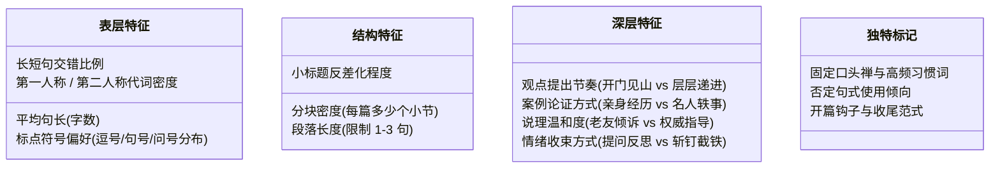

# 卷四：文风 DNA 建模 —— 告别千篇一律的机器腔

> “读者关注一个公众号，不是为了看一部百科全书，而是为了跟一个有血有肉、有脾气性格的活人保持长期的精神连接。”

---

## 1. 14 维文风 DNA 分析框架 (Style DNA Framework)

WorkBuddy 专家系统将一个作者的写作风格拆解为四层共 14 个维度的显式参数：



---

## 2. Python 文风量化提取脚本机制 (`build_style_profile.py`)

专家系统通过对作者历史 3~10 篇爆款原文运行量化脚本，直接提取出客观数据底盘：

```python
# scripts/build_style_profile.py 核心算法节选
def analyze_style(text):
    sentences = re.split(r"[。！？!?]+", text)
    avg_sentence_len = mean([len(s) for s in sentences if s.strip()])
    
    # 人称代词比例检测
    you_count = len(re.findall(r"你|你们", text))
    we_count = len(re.findall(r"我们", text))
    i_count = len(re.findall(r"我|自己", text))
    
    # 标点符号与否定结构检测
    em_dash_count = len(re.findall(r"[—–]", text))  # 破折号（AI典型标记）
    banned_not_but = len(re.findall(r"不是.*而是", text)) # 典型虚假对称句
    
    return {
        "avg_len": avg_sentence_len,
        "second_person_ratio": you_count / len(sentences),
        "fatal_ai_patterns": em_dash_count + banned_not_but
    }
```

---

## 3. 落地实操：文风 DNA 配置文件示例

为公众号作者生成的标准文风配置文件（可直接被 Prompt 引用）：

```markdown
# 作者文风 DNA 规范卡（示例：退休成熟知识博主）

## 1. 基础语调与人设
- **身份设定**：50岁左右退休大姐，心态开阔，阅历丰富，像老姐妹在茶室面对面聊天。
- **对话感**：全文使用“你”与“我”，高频互动（“你想想是不是这个理？”）。
- **情绪底色**：温和、包容但一针见血，不贩卖恐慌，不打鸡血。

## 2. 段落与标点配方
- **段落长度**：严格控制在 1~3 句话以内，在手机端显示绝不超过 4 行。
- **标点约束**：全篇禁用破折号（—），疑问句每篇 ≤4 处，句号与逗号为主。
- **金句节奏**：每 300 字必有一句独立成段的穿透性总结。

## 3. 绝对禁用
- 严禁年轻网络黑话（如“破防了”、“绝绝子”）。
- 严禁学术会议报告腔（如“由此可见”、“毋庸置疑”）。
- 严禁结尾使用“愿你……不负余生”等俗套祝词。
```
