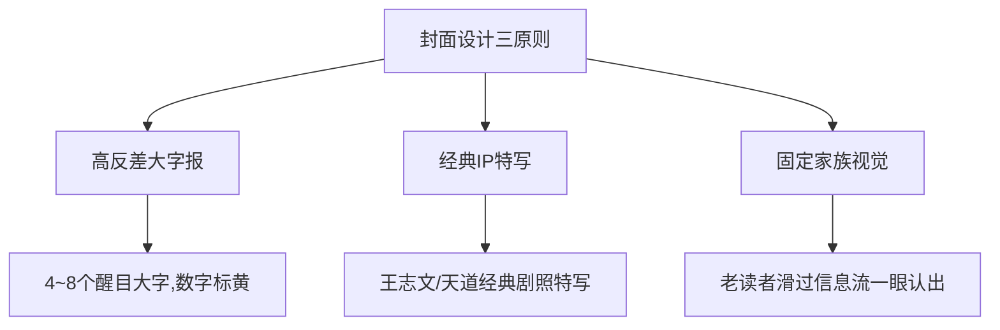

# 卷六：工具链与 CLI 实践 —— 微信爆文全自动工程化

> “真正的生产力革命，是用自动化流水线解放人类机械劳动，将创作者的精力 100% 聚焦在核心决策与人生体验上。”

---

## 1. 微信公众平台爆文对标爬虫 (`search_wechat.js`)

专家内置了独立的 Node.js 微信文章检索工具，通过搜狗微信搜索通道抓取全网真实数据：

```bash
# 进入脚本目录
cd scripts

# 基础搜索（获取最新10篇相关热文）
node search_wechat.js "天道 存钱" -n 10

# 保存到 JSON 供分析
node search_wechat.js "吸引力法则 转运" -n 20 -o trending_topics.json
```

### 技术实现要点：
- **随机 User-Agent 池**：内置 20 个不同平台（Mac、Win、iOS、Android）浏览器指纹轮换，杜绝单一指纹拦截。
- **自动解压支持**：适配 Gzip、Deflate、Brotli 等多种 Content-Encoding 响应。
- **输出结构化字段**：标题、摘要、来源公众号、发布时间、中间跳转链接。

---

## 2. 封面图设计哲学：打开率的另一半

在微信订阅号信息流中，读者决策是否点击仅需 0.5 秒。封面图的核心原则是：**不追求过度艺术化，追求小图里的视觉冲突**。



- **尺寸规范**：推荐主图 `900 × 383`（大图展示），同时必须保证正方形裁切预览图（`square_preview.png`）中关键文字完全居中不被裁切。
- **图文配合公式**：
  - 天道系列：深色王志文人物特写 + 醒目黄色反转大字。
  - 存钱系列：白底极简大红字，直接突出具体金额（如“10万”）。
  - 吸引力法则系列：暖金星空意境底图 + 居中好运暗示文案。

---

## 3. 自动化闭环：直接推送到微信后台草稿箱 (`mp-draft-push`)

官方专家采用微信公众平台官方 Draft API，打通最终发布链路：

```bash
# 环境变量配置
export WECHAT_APPID="wx1234567890abcdef"
export WECHAT_SECRET="your_secret_here"

# 推送命令（输入正文 HTML 与封面图路径）
./scripts/push_draft.sh --title "标题" --cover "cover.png" --content "article.html"
```

> **安全红线**：系统永远只调用草稿箱推送接口（`draft/add`），**绝对不直接调用群发接口（freepublish）**。每篇文章必须保留创作者在手机端或 PC 后台亲眼预览、亲手点击群发的最后一道防线！
