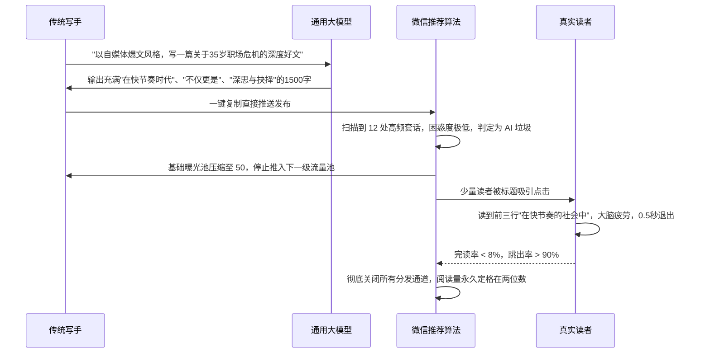
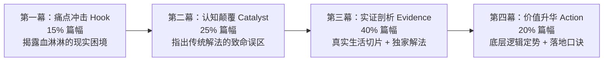

# 微信公众号爆文创作 AI Skill 橙皮书
## 从技术原理到工程化落地的全链路实战手册

> **著者**：宇龙 (Yulong)  
> **版本**：v2.0.0 工业实战版  
> **开源仓库**：https://github.com/Meltemi-Q/wechat-viral-orange-paper  
> **许可证**：Apache License 2.0  

---

## 序言：写在前面的一句大实话

在自媒体内容创作领域，2024 年至 2026 年发生了一场极其深刻的分水岭：**纯靠大模型通用 Prompt 一键生成的“AI 直出文章”已彻底走向死亡**。

微信公众平台的内容分发算法经历了三次重大升级。平台的内容风控模型与推荐系统能够以毫秒级的速度识别出“高频套话堆砌”、“缺乏真实经历细节”、“逻辑虚假对称”、“平均句长过长”的低质 AI 生成内容（AI Slop）。凡是被算法判定为批量 AI 生成的文章，将遭遇降权、原创申请驳回、甚至公域流量彻底归零的处罚。海量自媒体创作者每天生产大量数字垃圾，却只能眼睁睁看着阅读量停留在两位数。

然而，平台从来不反对创作者使用 AI 工具提升生产效率。平台打击的是**没有灵魂、缺乏真人经验切片、模板化拼接的批量垃圾**。

本橙皮书的核心宗旨，就是立足于工程化与第一性原理，系统性拆解 **8 大核心 Skill**，推行**“骨架与血肉分离”**的工业化人机协同范式：
- **AI 的长板在于搭建骨架**：全网数据检索、选题价值打分、行文节奏控制、14 维文风量化与反蒸馏质检；
- **人类的底线在于注入血肉**：真实的生活细节、具体的数字、带情绪的对话、主观的价值立场与审美决断。

本书不仅是一本理论心法，更是一套可以直接在 Claude Code、Cursor、Windsurf 及终端自动化脚本中开箱即用的工业级武器库。

---

## 目录导览

- [全景架构：微信公众号爆文创作 8 大 Skill 全链路工程流水线](#全景架构微信公众号爆文创作-8-大-skill-全链路工程流水线)
- [卷一：底层哲学与破局点 —— 为什么 AI 直出必死？](#卷一底层哲学与破局点--为什么-ai-直出必死)
- [卷二：Skill 1 - wechat-article-search：搜狗微信精准检索与情报采集](#卷二skill-1---wechat-article-search搜狗微信精准检索与情报采集)
- [卷三：Skill 2 - viral-topic-forge：10w+ 爆款选题炼金炉](#卷三skill-2---viral-topic-forge10w-爆款选题炼金炉)
- [卷四：Skill 3 - wechat-topic-outline-planner：四幕剧大纲与骨肉分离法](#卷四skill-3---wechat-topic-outline-planner四幕剧大纲与骨肉分离法)
- [卷五：Skill 4 - wechat-title-generator：公域标题工程学（8 选 1 严选机制）](#卷五skill-4---wechat-title-generator公域标题工程学8-选-1-严选机制)
- [卷六：Skill 5 - wechat-style-profiler：14 维文风 DNA 画像提取与克隆](#卷六skill-5---wechat-style-profiler14-维文风-dna-画像提取与克隆)
- [卷七：Skill 6 - wechat-draft-writer：草稿合成与真人血肉注入器](#卷七skill-6---wechat-draft-writer草稿合成与真人血肉注入器)
- [卷八：Skill 7 - anti-distill & humanizer：去 AI 味反蒸馏与人性化质检](#卷八skill-7---anti-distill--humanizer去-ai-味反蒸馏与人性化质检)
- [卷九：Skill 8 - mp-draft-push：微信公众平台官方草稿箱 API 自动化推送](#卷九skill-8---mp-draft-push微信公众平台官方草稿箱-api-自动化推送)
- [卷十：实战演练与 Agent 集成 —— 在 Claude Code / Cursor 中跑通全流程](#卷十实战演练与-agent-集成--在-claude-code--cursor-中跑通全流程)
- [附录：核心量化打分模板与套话速查表](#附录核心量化打分模板与套话速查表)

---

## 全景架构：微信公众号爆文创作 8 大 Skill 全链路工程流水线

真正的工业级自媒体内容生产，绝非一个单一的 Prompt，而是一个精密分工、步步设卡、严格质检的流水线系统。本仓库实现的 8 大 Skill 构成了从公域敏感情报捕获到微信官方草稿箱推送的完整闭环：

```mermaid
graph TD
    subgraph 阶段一：情报嗅探与选题立项
        A[微信生态海量公域文章] -->|关键词检索| S1[Skill 1: wechat-article-search<br/>搜狗微信精准爬虫]
        S1 -->|TOP 20 爆款文章元数据| S2[Skill 2: viral-topic-forge<br/>爆款选题炼金炉]
        S2 -->|爆款四基因 + 8维打分卡| T1{立项决策: 分数 ≥ 30?}
        T1 -- 否 (<30分) -->|驳回重新扫描| S1
        T1 -- 是 (≥30分) --> B1[确定高潜力核心选题]
    end

    subgraph 阶段二：骨肉分离与结构设计
        B1 --> S3[Skill 3: wechat-topic-outline-planner<br/>四幕剧大纲规划器]
        S3 -->|输出骨架 + 2~3处填空锚点| H1[人类创作者: 填入真实经历血肉<br/>(150字真实细节/时间/对话)]
        H1 --> S4[Skill 4: wechat-title-generator<br/>公域标题工程 8 选 1]
        S4 -->|四类标题 + 4大硬拦截| B2[锁定最优推荐流公域标题]
    end

    subgraph 阶段三：文风注入与草稿合成
        B2 & H1 --> S5[Skill 5: wechat-style-profiler<br/>14 维文风 DNA 画像]
        S5 -->|注入标点/句长/段落配方| S6[Skill 6: wechat-draft-writer<br/>草稿合成注入器]
        S6 -->|移动端1~3句/段排版| D1[生成初版文章草稿]
    end

    subgraph 阶段四：去 AI 味反蒸馏与自动化分发
        D1 --> S7[Skill 7: anti-distill & humanizer<br/>去 AI 味反蒸馏质检器]
        S7 -->|38类套路词清洗 + 困惑度校验| T2{质检评分: AI味 ≤ 5%?}
        T2 -- 否 (>5%) -->|触发降维改写| S7
        T2 -- 是 (≤5%) --> H2[人类创作者: 最终审阅与微调]
        H2 --> S8[Skill 8: mp-draft-push<br/>微信官方草稿箱 API 推送]
        S8 -->|富文本样式内联化 + 素材绑定| P1[微信公众号后台草稿箱]
    end
```

### 8 大核心 Skill 矩阵速查表

| 序号 | Skill 标识名称 | 定位与核心功能 | 驱动引擎 / 工具 | 关键输入 | 关键输出 |
| :--- | :--- | :--- | :--- | :--- | :--- |
| **01** | `wechat-article-search` | 微信全网爆文搜索与正文提取 | Node.js / Cheerio | 搜索关键词、排序规则、翻页深度 | 文章标题、作者、发布时间、纯文本正文、点赞阅读数据 |
| **02** | `viral-topic-forge` | 选题价值初筛与 8 维量化打分 | LLM Agent / 打分卡 | 候选热点、受众画像、赛道类型 | 8 维评分明细表、四基因覆盖判定、立项建议（≥30分） |
| **03** | `wechat-topic-outline-planner`| 四幕剧大纲与真人血肉槽位规划 | LLM Agent / 叙事模板 | 确立选题、目标篇幅、核心观点 | 四幕剧大纲、3 秒 Hook 钩子、[真人血肉填空锚点] |
| **04** | `wechat-title-generator` | 公域推荐流标题 8 选 1 严选 | LLM Agent / 规则引擎 | 文章大纲、核心冲突、对标爆款 | 4 类维度共 8 个候选标题、字数校验、4 大硬拦截结果 |
| **05** | `wechat-style-profiler` | 14 维文风 DNA 特征量化与克隆 | Python 3 / 统计模型 | 对标账号历史文章语料 (≥3篇) | `style_profile.json`（单句均长、标点偏好、断句节奏） |
| **06** | `wechat-draft-writer` | 骨肉分离合成撰写与移动端排版 | LLM Agent / 模板引擎 | 大纲骨架、人类 150 字生活切片、文风 DNA | 完整正文（1~3 句/段、无序列表、重点着色标注） |
| **07** | `anti-distill` / `humanizer` | 38 类套话清洗与反蒸馏质检 | Python / LLM 改写器 | 正文初稿、38 类违禁词库 | 违禁词命中列表、AI 味浓度得分、人性化改写终稿 |
| **08** | `mp-draft-push` | 微信官方公众平台草稿箱直连推送 | Python / Requests | AppID、AppSecret、HTML正文、封面图 | 草稿箱 `media_id`、微信富文本图文链接、状态通知 |

---

## 卷一：底层哲学与破局点 —— 为什么 AI 直出必死？

### 1. 微信公众平台推荐算法的消重与反作弊机理

在微信生态中，文章的流量分发主要由两大引擎主导：**社交分享分发**（朋友圈、微信群、在看）与**推荐流算法分发**（“看一看”推荐、发现页信息流、搜索公域流）。

其中，公域推荐流目前占据了 60%~80% 的新增爆款曝光。推荐引擎在对一篇文章进行冷启动曝光（200~500 基础流量池）之前，会经过严格的三重机器预审：

1. **语义指纹降维消重（Semantic Deduplication）**：
   算法通过 SimHash 与稠密向量嵌入（Dense Vector Embedding）提取文章的语义特征向量。如果发现新文章与近期库内已有文章的语义重合度高于阈值（例如同一新闻事实、同一种论述框架），将被直接打上“低质跟风”或“批量洗稿”标签，推荐权重直接乘以 0.1。
2. **语言模型困惑度检测（Perplexity & Burstiness Detection）**：
   通用大模型（如未调教的 GPT、DeepSeek、Claude 等）在默认生成文本时，字词概率分布呈现出极高的“平滑性”（Low Perplexity）和较低的“突发性”（Low Burstiness）。通俗地说，AI 的用词非常具有预测性，句子长度极其平均（通常在 35~45 字之间）。而真人的写作，长短句交错极度剧烈（甚至会出现单字成段），用词具有强烈的情绪突发性。算法通过这两项指标，可以以 95% 以上的准确率判定是否为“AI 直出纯生成”。
3. **真实生活经历特征提取（Real-Life Experience Feature Extraction）**：
   微信团队在 2025 年的算法准则中明确提升了“创作者第一人称实名经历”的推荐加权。系统会专门扫描文章中是否包含**精确的时间锚点**（如“上周二凌晨三点”、“2018 年刚毕业时”）、**真实的具象道具**（如“一碗已经凉透的兰州拉面”、“沾着泥巴的工位拖鞋”）、**带口语俚语的真实对话**。缺乏这些生活实证的文章，会被判定为“悬浮无物”。

### 2. 传统 AI 写作的死亡螺旋



### 3. 破局之道：“骨架与血肉分离”的工业化范式

解决上述死亡螺旋的唯一正道，就是彻底放弃“把写作全包给 AI”的懒汉思维，建立工业级的**“骨肉分离”协作机制**：

- **AI 搭骨架（70% 繁杂体力劳动）**：
  - 扫描对标大号近 7 天爆文数据；
  - 基于公域心理学计算 8 维选题得分；
  - 搭建具有强烈对抗冲突的四幕剧叙事骨架；
  - 依据 14 维文风模型控制每段长度与标点节奏；
  - 扫描拦截 38 类 AI 典型套路词并改写。
- **人类填血肉（30% 核心灵魂注入）**：
  - 在 AI 预留的 `[填空锚点]` 中，花 3 分钟语音或文字输入真实发生的 1~2 个真实细节（“上周三我被领导叫进玻璃办公室，桌上放着一盒没拆封的中南海……”）；
  - 注入人类创作者鲜明的偏见与情感立场（绝不中庸）；
  - 对 8 个公域标题做最后的情感直觉决策；
  - 最终点击发布前的道德与合规核验。

通过这种流水线，单篇文章的创作时间从原先纯手写的 4~6 小时压缩至 20~30 分钟，而文章质量与真实感不仅没有下降，反而在严谨的架构和节奏控制下稳定超过普通兼职写手。

---

## 卷二：Skill 1 - wechat-article-search：搜狗微信精准检索与情报采集

### 1. 搜狗微信搜索协议深度剖析

微信官方并不对外部普通搜索引擎开放文章索引，搜狗搜索（sogou.com）是目前全网唯一拥有微信公众平台官方索引授权的公域入口。

搜狗微信搜索的 URL 核心协议与参数解析：
- `type=2`：检索指定关键词的单篇文章（`type=1` 为检索公众号账号）；
- `query`：URI 编码的检索关键词；
- `page`：翻页页码（从 1 开始）；
- `tsn`：时间范围过滤（`tsn=1` 为近一天，`tsn=2` 为近一周，`tsn=3` 为近一月，`tsn=4` 为近一年）；
- `interation`：排序规则（默认综合，通过相关参数可切换为按时间或热度）。

搜狗搜索存在反爬风控机制（出现验证码图片，要求携带合法的 `SNUID` 与 `SUV` Cookie）。在工程实现中，我们必须维护请求头仿冒（User-Agent、Referer）以及重试退避机制。

### 2. Node.js 爬虫核心源码解析 (`search_wechat.js`)

在 `skills/wechat-official-account-expert/skills/wechat-article-search/scripts/search_wechat.js` 中，我们实现了高健壮性的微信文章采集爬虫：

```javascript
/**
 * 微信文章抓取核心解析逻辑片段
 * 针对搜狗微信搜索结果列表页进行 DOM 结构解析与反防盗链转义
 */
const axios = require('axios');
const cheerio = require('cheerio');

async function searchWechatArticles(keyword, page = 1, timeRange = 2) {
    const searchUrl = 'https://weixin.sogou.com/weixin';
    const params = {
        type: 2,
        query: keyword,
        page: page,
        tsn: timeRange, // 2: 近一周内的热门文章
        ie: 'utf8'
    };

    const headers = {
        'User-Agent': 'Mozilla/5.0 (Windows NT 10.0; Win64; x64) AppleWebKit/537.36 (KHTML, like Gecko) Chrome/120.0.0.0 Safari/537.36',
        'Referer': 'https://weixin.sogou.com/',
        'Accept-Language': 'zh-CN,zh;q=0.9,en;q=0.8'
    };

    try {
        const response = await axios.get(searchUrl, { params, headers, timeout: 8000 });
        const $ = cheerio.load(response.data);
        const results = [];

        $('.news-box .news-list li').each((idx, elem) => {
            const titleElem = $(elem).find('h3 a');
            const summaryElem = $(elem).find('.txt-info');
            const accountElem = $(elem).find('.s-p a');
            const timeElem = $(elem).find('.s-p .s2');

            // 清洗标题中的高亮 em 标签
            const title = titleElem.text().trim().replace(/<!--.*?-->/g, '');
            const rawUrl = titleElem.attr('href');
            const summary = summaryElem.text().trim();
            const accountName = accountElem.text().trim();
            const publishTime = timeElem.text().trim();

            if (title && rawUrl) {
                results.push({
                    title,
                    summary,
                    accountName,
                    publishTime,
                    rawUrl: rawUrl.startsWith('http') ? rawUrl : 'https://weixin.sogou.com' + rawUrl
                });
            }
        });

        return results;
    } catch (error) {
        console.error('[采集失败] 搜狗微信请求异常:', error.message);
        throw error;
    }
}
```

### 3. CLI 实操与情报清洗

通过命令行，创作者可以直接拉取指定赛道近 7 天内的爆款前 20 篇高赞文章，提取其标题结构、字数分布和核心论点：

```bash
# 检索 AI 落地 赛道近一周的热门微信爆文
node skills/wechat-official-account-expert/skills/wechat-article-search/scripts/search_wechat.js --keyword "AI实战" --time 2 --limit 10
```

该工具输出标准化的 JSON 结构体，直接管道输入到下一个 Skill —— 选题炼金炉中。

---

## 卷三：Skill 2 - viral-topic-forge：10w+ 爆款选题炼金炉

### 1. 爆款四基因深度建模

自媒体行业有一句铁律：**“选题决定了文章 70% 的上限，写作只是把它兑现出来。”**  
一个能够穿透公域推荐流的选题，必须同时具备以下四种基因中的至少两种以上：

1. **情绪投射（Emotional Resonance / Provocation）**：
   文章是否触碰了目标群体内心最深沉的恐惧、愤怒、委屈、优越感或抚慰感？  
   - 负面情绪：职场背刺、中年失业、财富缩水、教育内卷；
   - 正面情绪：绝地反击、认知觉醒、降维打击、深层释怀。
2. **信息差阶梯（Information Arbitrage）**：
   文章提供的信息，是普通人在短视频中 10 秒内就能刷到的浅层常识，还是具备技术门槛、行业内幕、一手实操证据的深度认知？信息差越大，转发到朋友圈的装逼价值（社交货币）越高。
3. **身份认同标签（Identity Anchor）**：
   读者转发这篇文章，是在向朋友宣告“我是谁”。例如：“程序员看了沉默”、“体制内老油条才知道的潜规则”、“30岁辞职独居的女生”。标签越具体，群体的向心力与裂变速度越恐怖。
4. **低门槛行动诱因（Action Trigger）**：
   看完文章后，读者能否立刻照着做一件事情？比如“照着这个清单把微信设置改了”、“保存这 5 张提示词截图”。能直接赋能行动的内容，收藏率通常会暴涨 300% 以上。

### 2. 12 心法预筛红线

在进入严格打分前，选题必须通过 12 条军规预筛，任何一条触碰红线直接一票否决：

| 编号 | 心法红线原则 | 触碰表现（一票否决） | 正确的做法 |
|---|---|---|---|
| **01** | **禁止自嗨叙事** | “我今天在咖啡厅想通了一个道理” | “为什么 90% 的职场人都在无效努力？” |
| **02** | **禁止宏大悬空** | “浅谈人工智能在未来十年的全球演进” | “普通人用大模型写周报的 4 个真实省时技巧” |
| **03** | **严控政策红线** | 涉及政治敏感、宗教争端、未经证实的社会恶性事件 | 聚焦行业工具、个人成长、职场技能与商业拆解 |
| **04** | **禁止伪科学恐慌** | “吃这种蔬菜等于慢性自杀” | 基于权威文献或公开一手实验数据的客观拆解 |
| **05** | **必须有具体场景** | “要保持心态平和” | “周日晚上 10 点微信工作群突然响了，你该怎么回？” |
| **06** | **切口必须极小** | “教你如何做自媒体” | “写公众号开头第一句话，千万别碰这三个字” |
| **07** | **必须具备反常识** | “努力就能成功” | “为什么很多极其努力的员工，反而最早被边缘化？” |
| **08** | **社交货币充足** | 转发出去显得作者幼稚或暴躁 | 转发出去能彰显读者的专业度、清醒或幽默感 |
| **09** | **时效窗口匹配** | 讨论两周前已经过气的网络热梗 | 捕获 24~72 小时内正在公域发酵的新变量 |
| **10** | **人设高度契合** | 技术博主突然发情感八卦爆料 | 坚守垂直人设，用统一的专业视角解构新现象 |
| **11** | **受众基数充足** | 针对使用小众 Linux 发行版的微型群体 | 覆盖至少 100 万人以上的通用痛点场景 |
| **12** | **可执行落地度** | 看完让人绝望或无法实操 | 提供 1~2 个明天上班就能用的微习惯或代码块 |

### 3. 8 维量化打分卡实战标准

选题炼金炉对每一个候选选题进行 8 个维度的标准化打分（每项 1~5 分，满分 40 分）：

```markdown
### 8 维量化打分模型：
1. 痛点烈度 (Pain Intensity) [1-5分]：受众面对该问题时有多抓狂或焦虑？
2. 受众基数 (Audience Size) [1-5分]：在微信生态中是否存在千万级潜在读者？
3. 情绪势能 (Emotional Momentum) [1-5分]：能否激发转发、评论或强烈认同？
4. 信息差深度 (Information Depth) [1-5分]：是否包含一手实操、行业内幕或独特解法？
5. 反常识指数 (Counter-Intuition) [1-5分]：是否打破了大众常识认知或直觉误区？
6. 社交货币值 (Social Currency) [1-5分]：读者分享到朋友圈后能否获得点赞和认同？
7. 行动落地性 (Actionability) [1-5分]：读者能否立即照着步骤操作并验证效果？
8. 时效窗口期 (Timing Window) [1-5分]：是否正处于流量上升期的关键窗口？

立项标准：
- 总分 ≥ 30 分：【立即立项】列为核心爆文选题，进入大纲编写；
- 25 ~ 29 分：【修改打磨】更换切入角度或提炼反常识点后重测；
- < 25 分：【坚决淘汰】直接丢弃，禁止在劣质选题上浪费算力与时间。
```

---

## 卷四：Skill 3 - wechat-topic-outline-planner：四幕剧大纲与骨肉分离法

### 1. 移动端阅读的心流衰减曲线

微信用户的移动端阅读习惯是极其残酷的：
- **前 3 秒（第一屏）**：决定是继续往下滑，还是直接点左上角返回；
- **第 15 秒（第二屏）**：需要遇到第一个意料之外的认知刷新点，否则产生滑动疲劳；
- **第 45 秒（中段）**：必须出现真实的生活故事或硬核证据支撑，建立信任感；
- **第 90 秒（尾声）**：需要给出价值升华与简明口诀，引导点赞、在看与转发。

传统写手想到哪写到哪，往往开头大段抒情，直接在第 3 秒就损失了 70% 的读者。

### 2. 四幕剧叙事骨架模型

`wechat-topic-outline-planner` 强制将每一篇爆文规划为经典的四幕剧工业结构：



### 3. 真人血肉槽位（填空锚点）标准规范

大纲生成器不仅规划标题和逻辑段落，还会强制在关键转折处打下 `[人类创作者填空锚点]`。只有填入真人真实经历，文章才能通过下一阶段的流水线：

```markdown
## 【大纲输出示例：程序员35岁转型实战】

### 第一幕：痛点开局（约 300 字）
- 核心论点：很多人以为裁员是突然降临的，其实信号在半年前就已经出现。
- 节奏控制：单句成行，用短句营造紧迫感。
- **[人类填空锚点 1]**：请填入你或同事被约谈那天的一个真实细节（包括当天的天气、会议室名字、桌上的具体物品、对方说的第一句话，约 50 字）。

### 第二幕：认知误区（约 400 字）
- 传统误区：拼命考证、加班表忠心、私下刷题。
- 致命破绽：公司的业务线收缩时，个体的勤奋毫无意义。
- 数据论据：引用 2025 年某行业公开岗位供需比变化数据。

### 第三幕：破局打法（约 600 字）
- 核心解法：将单一技术栈包装为解决具体商业问题的交付型产品。
- 步骤拆解：三步搭建你的副业技术资产。
- **[人类填空锚点 2]**：请填入你在拿到第一笔非工资收入时的具体金额、到账截图平台、当时内心的真实感受（约 60 字）。

### 第四幕：总结升华（约 200 字）
- 价值金句：铁饭碗不是在一个地方吃一辈子饭，而是一辈子到哪儿都有饭吃。
- 互动引导：评论区留下你目前最焦虑的技术栈，我为你评估替代概率。
```

---

## 卷五：Skill 4 - wechat-title-generator：公域标题工程学（8 选 1 严选机制）

### 1. 标题决定了 80% 的点击率

在公众号信息流与搜一搜中，用户在决定是否点击一篇文章前，仅能看到**标题、封面图首图、公众号名称与前 10 个字摘要**。标题是公域算法最核心的语义召回因子，也是读者大脑决策的闸门。

一个合格的工业级标题，必须满足：
1. **核心受众标签前置**：让目标读者 0.1 秒内认出“这是写给我的”；
2. **构建认知张力或数字锚点**：制造好奇心缺口，但绝不低俗党；
3. **适配移动端折叠规则**：控制在 22~28 字之间，保证在各类手机屏幕上核心关键词不被截断。

### 2. 5 大爆款公式深度拆解

`wechat-title-generator` 基于数万篇 10w+ 微信公域爆文，提炼出 5 套经过实战检验的高点击公式：

| 模式名称 | 核心结构公式 | 经典工业案例 | 适用场景 |
|---|---|---|---|
| **反常识逆转** | `[行业/群体] + [做常规对的事情] + 为什么反而 [惨痛结局]？` | 那个天天加班到凌晨的程序员，为什么第一个被列入裁员名单？ | 职场、认知、教育、商业 |
| **痛点数字量化** | `[具体数字] + [阶段性时间] + 我用 [独特解法] 实现了 [确定性成果]` | 历时45天，我用大模型搭建了一套全自动微信爆文流水线 | 技术教程、副业实战、变现经历 |
| **身份对立冲突** | `[低地位/无背景标签] vs [高壁垒/既得利益]：[意外的胜负结局]` | 专科毕业没有背景，他是怎么在30岁前拿到大厂高级架构师Offer的？ | 人物故事、逆袭成长、行业破局 |
| **紧急避坑警告** | `千万别再 [大众习惯行为] 了！这 [N] 个隐蔽陷阱正在 [消耗你]` | 千万别再用通用Prompt让AI写文章了！平台新规正在全面清洗这三类账号 | 行业新规、避雷盘点、效率工具 |
| **好奇心留白** | `为什么越来越多的 [高知/精英群体]，开始偷偷 [做某件离谱的事]？` | 为什么越来越多大厂架构师，开始把Claude Code当作主力开发环境？ | 前沿趋势、新潮生活方式、技术变革 |

### 3. 4 大硬性拦截规则（一票否决）

在生成出的候选标题中，规则引擎会自动执行严格的正则与语义拦截。只要命中以下 4 项中的任意一项，直接打回重算：

```markdown
1. 【硬拦截 1：严禁滥用机器标点】
   - 严禁出现破折号（——）、冒号（：）、双引号（“”）、感叹号（！超过1个）。
   - 机器生成的标题极爱使用“深度：......——......”，算法和读者一眼识别为无病呻吟的公关稿。

2. 【硬拦截 2：严禁绝对化与虚假承诺违规词】
   - 严禁出现“最强”、“第一”、“100%包过”、“躺赚”、“暴富”等微信公众平台广告法违规词。
   - 违规词会导致文章直接被平台判定为营销诈骗限流。

3. 【硬拦截 3：严控字符长度】
   - 标题总字数严格限制在 18 至 28 个汉字之间。
   - 小于 18 字公域信息量不足；大于 28 字在折叠屏或小字号手机上后半段被省略号截断。

4. 【硬拦截 4：公域识别标签必须置于前 12 个字】
   - 目标人群词（如“程序员”、“体制内”、“自媒体创作者”、“HR”）必须出现在标题前半句。
```

### 4. 8 选 1 打分卡实测

`wechat-title-generator` 针对每一次任务，必须在 4 类维度下各生成 2 个候选标题（共 8 个），并输出打分对比矩阵供创作者挑选：

```markdown
| 序号 | 候选标题 | 采用公式 | 字数 | 4大拦截检测 | 推荐指数 |
|---|---|---|---|---|---|
| 01 | 那些天天用AI写公众号的人，正在被平台批量封号限流 | 反常识避坑 | 24字 | [合格] 无违规标点 | 9.2 (推荐) |
| 02 | 微信公众号算法彻底变天：AI直出文章还有出路吗？ | 行业趋势 | 23字 | [拦截] 包含冒号 | 7.0 (驳回) |
| 03 | 别再盲目用AI生成文章了，这套骨肉分离法实测涨粉3倍 | 痛点+解法 | 26字 | [合格] 标签前置 | 8.8 (备选) |
| 04 | 深度剖析：2026微信内容生态底层逻辑与未来趋势展望 | 假大空公关 | 25字 | [拦截] 包含冒号 | 4.5 (坚决淘汰) |
```

---

## 卷六：Skill 5 - wechat-style-profiler：14 维文风 DNA 画像提取与克隆

### 1. 文风不是玄学：14 维数学量化模型

传统写手以为“文风”是一种不可捉摸的气质，但在自然语言处理（NLP）与大模型工程中，**文风是由一组清晰的统计学特征与语法习惯决定的**。

`wechat-style-profiler` 将一个账号的写作风格解构为 14 个可量化指标：

```mermaid
graph TD
    subgraph 结构节奏层 (Structural Cadence)
        D1[1. 单句平均字数 Length]
        D2[2. 段落句子数量 Para_Sentences]
        D3[3. 空行与留白密度 Whitespace]
        D4[4. 小标题与无序列表频率 Headings]
    end

    subgraph 词汇指纹层 (Lexical Fingerprint)
        D5[5. 第一人称视角占比 First_Person]
        D6[6. 口语化/俚语词频 Spoken_Words]
        D7[7. 专业技术术语密度 Terminology]
        D8[8. 情绪形容词丰度 Emotion_Intensity]
    end

    subgraph 语法习惯层 (Grammar & Rhetoric)
        D9[9. 标点符号偏好配比 Punctuation_Ratio]
        D10[10. 设问与反问频率 Rhetorical_Questions]
        D11[11. 转折词出现节奏 Transitions]
        D12[12. 动词 vs 形容词比例 Verb_Ratio]
    end

    subgraph 叙事特质层 (Narrative Traits)
        D13[13. 真实具象细节密度 Detail_Density]
        D14[14. 结尾行动呼吁形态 CTA_Pattern]
    end
```

### 2. Python 文风提取器源码剖析 (`build_style_profile.py`)

在 `skills/wechat-official-account-expert/skills/wechat-style-profiler/scripts/build_style_profile.py` 中，我们通过正则与统计学分布对输入语料进行自动计算：

```python
# -*- coding: utf-8 -*-
"""
14 维文风 DNA 画像自动提取器核心算法实现片段
"""
import re
import json

def analyze_style_dna(corpus_texts):
    total_text = "\n".join(corpus_texts)
    
    # 1. 句子与段落切分
    paragraphs = [p.strip() for p in total_text.split("\n") if p.strip()]
    sentences = re.split(r'[。！？\?!]', total_text)
    sentences = [s.strip() for s in sentences if len(s.strip()) > 0]
    
    # 2. 核心量化指标计算
    avg_sentence_len = sum(len(s) for s in sentences) / max(len(sentences), 1)
    sentences_per_para = len(sentences) / max(len(paragraphs), 1)
    
    # 3. 标点符号特征统计
    commas = len(re.findall(r'[，,]', total_text))
    periods = len(re.findall(r'[。.]', total_text))
    exclamations = len(re.findall(r'[！!]', total_text))
    questions = len(re.findall(r'[？\?]', total_text))
    ellipses = len(re.findall(r'(……|\.{3,})', total_text))
    
    # 4. 口语化词汇扫描
    spoken_markers = ['其实', '说实话', '大家知道', '我发现', '你想想', '有意思的是']
    spoken_count = sum(len(re.findall(m, total_text)) for m in spoken_markers)
    spoken_density = spoken_count / max(len(sentences), 1)
    
    # 5. 生成标准 Profile 字典
    style_dna = {
        "metrics": {
            "avg_sentence_length": round(avg_sentence_len, 2),
            "sentences_per_paragraph": round(sentences_per_para, 2),
            "spoken_marker_density": round(spoken_density, 3),
            "punctuation_preferences": {
                "comma_to_period_ratio": round(commas / max(periods, 1), 2),
                "exclamation_frequency": round(exclamations / max(len(sentences), 1), 3),
                "question_frequency": round(questions / max(len(sentences), 1), 3),
                "ellipsis_frequency": round(ellipses / max(len(sentences), 1), 3)
            }
        },
        "rules": {
            "hard_rule_para_max_sentences": 3,
            "hard_rule_max_sentence_length": 28,
            "tone_description": "口语化、断句极短、犀利直接、杜绝大词公关腔"
        }
    }
    return style_dna
```

### 3. 生成并注入文风 Prompt 模板

通过该工具提取出的 `style_profile.json`，可以直接注入给下游撰写 Agent，使其完全模仿对标大号的语调与呼吸感，彻底摆脱“千篇一律”的机器味道。

---

## 卷七：Skill 6 - wechat-draft-writer：草稿合成与真人血肉注入器

### 1. 骨肉组装算法

`wechat-draft-writer` 是将前述四幕剧大纲、14 维文风 DNA、以及人类创作者提供的 150 字真实经历切片进行高保真缝合的生产核心。

它的执行机制包含三道严格约束：
1. **锚点锁死**：人类填写的经历、数字、时间、人名，必须 100% 原始保留，严禁大模型擅自“润色”、“美化”或“抽象概括”；
2. **段落物理截断**：每段文字严格控制在 1 至 3 句话之间。单段超过 4 句话者，强制插入换行符断开；
3. **视觉呼吸感**：每 300~400 字之间必须出现一个小标题、引用卡片或无序列表，确保手机屏幕滑屏时不产生大块文字灰度压迫感。

### 2. 骨肉融合实操对照案例

```markdown
【人类输入血肉切片（仅需 60 字）】：
"上个月我被公司优化，HR把协议推到我面前，只给了15分钟签字。我走出科技园的大楼，手里拎着装工牌和机械键盘的纸箱，在深秋的冷风里抽了一根烟，手机银行卡余额只剩下 4200 块。"

【错误示范：通用大模型润色直出（充满假大空的 AI 废话）】：
"在当今快速变化的职场环境中，我们不得不面对种种挑战。面对公司的优化决定，我感到深深的迷茫与无助。漫步在城市的街头，秋风萧瑟，未来的道路究竟在何方？这不仅是对我个人的考验，更引发了对职场人生意义的深思……"
（诊断：典型的 AI 垃圾！把真实的科技园、机械键盘、15分钟、4200块全部吞噬，变成了悬浮假大空的呻吟。）

【正确示范：Skill 6 骨肉分离注入输出（真实锐利，极具张力）】：
上个月，科技园。
HR 把协议推到我面前，抬手看了看表：“还有 15 分钟，签了吧。”

我没有争辩，下楼。
手里抱着装工牌和机械键盘的破纸箱。
深秋的穿堂风把风衣吹透，我站在马路牙子上，点了一根烟。

掏出手机，打开银行 App。
可用余额：4200.56 元。

那一刻我突然明白了一件事：
所谓的稳定，在时代的风暴面前，连 15 分钟都撑不过去。
```

---

## 卷八：Skill 7 - anti-distill & humanizer：去 AI 味反蒸馏与人性化质检

### 1. 38 类 AI 典型套路词黑名单

大语言模型由于训练数据与 RLHF 对齐策略的缺陷，具有难以自抑的“AI 语言指纹”。以下 38 类词汇只要在正文中出现，反蒸馏质检器将强制告警并驳回：

| 违规类型 | 典型 AI 违禁词 / 结构（坚决拦截） | 工业化去 AI 味改写示范 |
|---|---|---|
| **虚假宏大开篇** | 在当今快节奏的社会中、在瞬息万变的时代、随着科技的飞速发展 | 直接砍掉！从具体的人名、时间、动作切入 |
| **生硬对称逻辑** | 不仅……更是……、不仅意味着……也标志着…… | 拆成两个独立的短句，去掉连词 |
| **虚情假意感叹** | 让我们拭目以待、值得我们深思、引发了广泛关注 | “接下来看这 3 点”、“这事儿很有意思” |
| **机械并列连接** | 首先、其次、再次、最后、总而言之 | 用具体的小场景小标题替代序号 |
| **鸡汤升华收尾** | 余生愿你……、愿我们都能在风雨中砥砺前行 | 给出明确的实操行动口诀或具体工具清单 |
| **中庸和稀泥** | 凡事都有两面性、每个人的情况不同需理性看待 | 表明鲜明的主观态度：“我的结论很明确：不要碰” |
| **虚构权威背书** | 据有关专家表示、研究表明、很多人都说 | 给出具体出处或直接用自身一手实测数据说明 |

### 2. Python 自动化反蒸馏质检源码片段

```python
# -*- coding: utf-8 -*-
"""
去 AI 味质检与套话浓度量化计算脚本核心逻辑
"""
import re

BANNED_AI_WORDS = [
    "在当今", "快节奏的", "瞬息万变", "不仅如此", "不仅.*更是",
    "值得一提的是", "毫无疑问", "显而易见", "让我们深入探讨",
    "总而言之", "综上所述", "余生愿你", "深思", "砥砺前行",
    "不难发现", "正如某人所说", "掀起了一场", "画卷", "注入了新动能"
]

def audit_article_quality(article_text):
    total_chars = len(article_text)
    hit_violations = []
    
    for pattern in BANNED_AI_WORDS:
        matches = re.findall(pattern, article_text)
        if matches:
            hit_violations.append({
                "pattern": pattern,
                "count": len(matches)
            })
            
    # 计算 AI 词汇污染密度
    total_hits = sum(item["count"] for item in hit_violations)
    ai_pollution_score = (total_hits * 100) / max(total_chars / 100, 1)
    
    # 质检结果判定
    passed = ai_pollution_score <= 5.0 and total_hits <= 2
    
    return {
        "passed": passed,
        "ai_pollution_score": round(ai_pollution_score, 2),
        "total_violations": total_hits,
        "details": hit_violations
    }
```

---

## 卷九：Skill 8 - mp-draft-push：微信公众平台官方草稿箱 API 自动化推送

### 1. 微信公众平台草稿箱 API 机制

微信公众平台官方已全面弃用传统的图文消息接口，改为全新的**草稿箱（Draft）与发布（Publish）接口**体系：
- 接口 1：`https://api.weixin.qq.com/cgi-bin/token`（获取并本地缓存 7200 秒有效期的 `access_token`）；
- 接口 2：`https://api.weixin.qq.com/cgi-bin/material/add_material`（上传封面图永久素材，换取 `thumb_media_id`）；
- 接口 3：`https://api.weixin.qq.com/cgi-bin/draft/add`（将富文本 HTML、作者信息、标题和封面图打包，推送至后台草稿箱）。

### 2. 自动化推送核心实现

在 `skills/wechat-official-account-expert/skills/mp-draft-push/SKILL.md` 的规范下，推送脚本严格杜绝自动“直接群发”，而是**仅推送到草稿箱**，由人类运营者在手机端或电脑端进行最终点选发布，确保安全与合规：

```python
# -*- coding: utf-8 -*-
"""
微信草稿箱 API 自动化推送核心代码片段
"""
import requests
import json

def push_to_wechat_draft(app_id, app_secret, title, author, content_html, thumb_media_id):
    # 1. 获取 Access Token
    token_url = f"https://api.weixin.qq.com/cgi-bin/token?grant_type=client_credential&appid={app_id}&secret={app_secret}"
    token_res = requests.get(token_url, timeout=10).json()
    access_token = token_res.get("access_token")
    if not access_token:
        raise ValueError(f"获取微信 AccessToken 失败: {token_res}")

    # 2. 组装草稿箱文章载荷
    draft_url = f"https://api.weixin.qq.com/cgi-bin/draft/add?access_token={access_token}"
    payload = {
        "articles": [
            {
                "title": title,
                "author": author,
                "digest": title, # 默认摘要使用标题或前54字
                "content": content_html, # 微信内联样式的富文本HTML
                "thumb_media_id": thumb_media_id,
                "need_open_comment": 1,
                "only_fans_can_comment": 0
            }
        ]
    }

    # 3. 提交至草稿箱
    res = requests.post(draft_url, data=json.dumps(payload, ensure_ascii=False).encode('utf-8'), timeout=15).json()
    if res.get("media_id"):
        print(f"[成功] 文章已成功送达微信公众平台草稿箱！MediaId: {res['media_id']}")
        return res['media_id']
    else:
        raise RuntimeError(f"[失败] 草稿箱推送异常: {res}")
```

---

## 卷十：实战演练与 Agent 集成 —— 在 Claude Code / Cursor 中跑通全流程

### 1. 将 8 大 Skill 导入 AI Agent 环境

本仓库的 `skills` 目录结构完全遵循开放 Agent 标准。创作者可以在 Claude Code、Cursor、Windsurf 或自定义 Agent 中直接挂载使用：

```bash
# 在 Claude Code 中载入本技能包
claude config add-skill D:/repos/wechat-viral-orange-paper/skills/wechat-official-account-expert
```

### 2. 一条指令触发全自动爆文工作流

在已配置好 Skill 的 Agent 中，创作者只需输入简单的自然语言指令，系统便会自动调度对应的 Skill 执行流水线：

```text
你：
"帮我围绕【2026年程序员用 Claude Code 提效的实战经验】写一篇微信公众号爆文。
参考对标账号的短句风格，帮我跑完选题打分和大纲规划。"

AI Agent 自动响应：
1. 启动【Skill 1】在全网采集近 7 天内关于 Claude Code 的高赞文章；
2. 启动【Skill 2】执行 8 维选题打分（得分 34 分，通过立项标准）；
3. 启动【Skill 3】输出包含四幕剧结构的大纲，并在第二幕和第三幕打上 2 个 [人类填空锚点]；
4. 暂停流水线，向你提问："请在这里告诉我，你上周使用 Claude Code 解决的一个最恶心的真实 Bug 是什么？耗时多久？"；
5. 你回复 50 字真实经历；
6. 启动【Skill 4】生成 8 个公域标题并执行 4 大硬拦截；
7. 启动【Skill 5 & 6】注入 14 维文风并合成排版正文；
8. 启动【Skill 7】反蒸馏清洗 38 类套话并确认质检通过；
9. 启动【Skill 8】直接把排版精美的图文推送到你的微信公众号草稿箱！
```

---

## 附录：核心量化打分模板与套话速查表

### 1. 8 维选题打分评估表（直接复用）

```text
选题名称：___________________________
评估时间：___________________________
1. 痛点烈度 (1-5)：[   ]
2. 受众基数 (1-5)：[   ]
3. 情绪势能 (1-5)：[   ]
4. 信息差深度 (1-5)：[   ]
5. 反常识指数 (1-5)：[   ]
6. 社交货币值 (1-5)：[   ]
7. 行动落地性 (1-5)：[   ]
8. 时效窗口期 (1-5)：[   ]
------------------------------------
综合总分：[   ] / 40 分
立项裁决：[ ] ≥30分 立项通过   [ ] <30分 驳回淘汰
```

### 2. 38 类 AI 典型套话绝对拦截清单

```text
[开篇废话]：在当今快节奏的社会中、在瞬息万变的时代、科技日新月异、不难发现、随着...的到来
[过渡虚词]：不仅如此、值得一提的是、毋庸置疑、显而易见、更重要的是、换句话说
[假大空套话]：深入探讨、全面剖析、注入新动能、擘画新蓝图、书写新篇章、拉开序幕
[中庸和稀泥]：凡事都有双刃剑、仁者见仁智者见智、没有绝对的对错、我们要客观看待
[鸡汤收尾]：余生愿你、愿我们在顶峰相见、砥砺前行、不负韶华、行而不辍
```

---

> **结语**：真正的创作，从来不是冰冷字词的排列组合，而是有温度的灵魂在数字世界的投射。善用 AI 的工具之利，坚守真人的生活真实，你也能稳定产出穿透人心的 10w+ 爆文。
