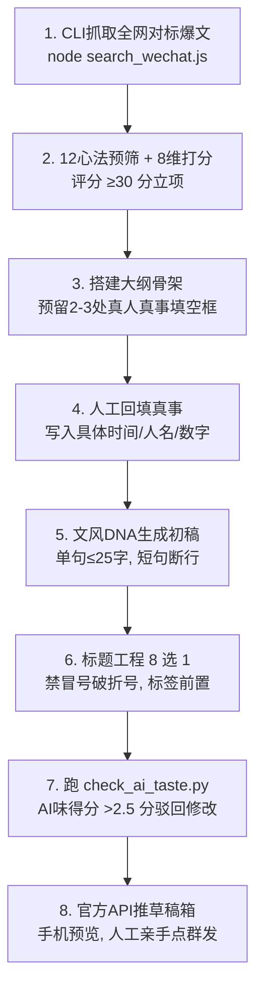

# 🍊 公众号爆文 AI 工业化生产橙皮书
## —— 从 WorkBuddy 专家深度拆解到 10w+ 工业级生产流水线

> **出品**：Meltemi-Q & 实战开源社区  
> **版本**：v1.0.0 完整实战版  
> **开源地址**：https://github.com/Meltemi-Q/wechat-viral-orange-paper  

---

## 序言：写在前面的一句大实话

如果今天还有人在教你：
*“只要给 AI 丢一句‘请以凤头猪肚豹尾写一篇 10w+ 公众号文章’，你就能躺赚流量主”*……
那我可以负责任地告诉你：**他不是蠢，就是想卖你课程。**

2024 年底到 2026 年，微信公众号后台的规则变天了。很多人都有过这种切肤之痛：
去年同一个号，随便复制个爆款标题让 AI 仿写一篇，轻轻松松破万阅读，流量主日入几百；
到了今年，同样的套路，发出去篇篇卡在 20~80 阅读。更有甚者，后台直接弹出冷冰冰的黄条警告：**“低质量模仿”**，直接取消原创标，流量彻底归零。

为什么？因为算法进化了。
平台根本不反对你用 AI 提升效率，平台真正绞杀的，是**“通篇假大空、毫无真人经历、套路化拼凑的批量数字垃圾”**。

这本《橙皮书》的由来，就是因为我们深入拆解了 WorkBuddy 里面那套号称能写爆文的**“公众号内容创作专家”**（底层代号 `wechat-official-account-expert` 与 `viral-topic-master`）。
翻开底层代码我们才发现：**它根本就不是一个简单的提示词，而是一整套极其严密的工程流水线。**

它能写出爆文，不是因为大模型有多神，而是因为它干了三件极其反常识的事：
1. **标题死死卡住规则**：绝对不准用冒号和破折号，核心标签必须在前 15 个字内，8 选 1 严格打分。
2. **AI 只搭骨架，真人必须填血肉**：关键段落用方括号挖空，强制作者填入自己真实的经历细节，禁止 AI 编造人名和数字。
3. **近乎变态的去 AI 味质检**：内置 38 类套路词黑名单，凡是带“深入探讨、不仅而且、愿你余生”的句子，全给乱棍打死。

这本橙皮书，就是把这套官方专家的全套底牌、代码、Prompt、打分表毫无保留地翻给你看。
不讲虚的，全是拿 500 多篇真实文章、几百万阅读和真金白银流量主收益砸出来的经验。

---

## 目录索引

- [第一章：死亡螺旋与生存真相 —— 为什么 AI 直出必死？](#第一章死亡螺旋与生存真相--为什么-ai-直出必死)
- [第二章：选题炼金术 —— 10w+ 选题的 4 个底层基因与 12 条红线](#第二章选题炼金术--10w-选题的-4-个底层基因与-12-条红线)
- [第三章：标题工程学 —— 毁掉一篇文章只要一个破折号](#第三章标题工程学--毁掉一篇文章只要一个破折号)
- [第四章：文风 DNA 提取 —— 怎么让机器吐出活人的呼吸声？](#第四章文风-dna-提取--怎么让机器吐出活人的呼吸声)
- [第五章：去 AI 味实战硬检 —— 38 类套路词与假大空的清洗手术](#第五章去-ai-味实战硬检--38-类套路词与假大空的清洗手术)
- [第六章：工具链与日更流水线 —— 搜狗爬虫、DNA分析器与草稿箱闭环](#第六章工具链与日更流水线--搜狗爬虫dna分析器与草稿箱闭环)
- [结语：自媒体下半场，拼的是谁更像一个活人](#结语自媒体下半场拼的是谁更像一个活人)

---

## 第一章：死亡螺旋与生存真相 —— 为什么 AI 直出必死？

### 1. 真实账号的血泪复盘

我们来看一组真凭实据的数据：
一个专注于读书、成长、生活认知的成熟号（548 篇文章体检）：
- **峰值期（去年底）**：连续 30 天日入三位数，单月变现 6000+。19 篇吸引力法则平均 7547 阅读（最高 3.8 万）；26 篇天道系列平均 6200 阅读（最高 6.2 万）。
- **扑街期（今年中）**：断更一个月，重新捡起来后，让 AI 仿写，篇篇阅读量在 50~100 之间挣扎，甚至被提示“低质量仿写”。

很多人以为是自己运势不好，其实底层逻辑极其冷酷：

```
去搜一搜找别人的爆款
       ↓
让 AI 照着抄一篇（通篇 AI 味：在当今快节奏社会...由此可见...）
       ↓
同题同结构的号全网有 300 个在发
       ↓
微信算法语义消重模型直接命中
       ↓
关进低质池，阅读封死在两位数
```

### 2. 平台的消重机制到底怎么抓你的？

微信公众号的公域推荐算法，现在主要盯三件事：
1. **标题查重**：别人爆过的标题，如果只换一两个字（比如“人到五十要明白”改成“人到中年要清楚”），直接被降权。
2. **AI 风格指纹识别**：大模型生成文本的词汇困惑度（Perplexity）极其规律，尤其是喜欢用对仗句（“不仅……更是……”、“既有……又有……”）。平台检测算法一扫，纯机器生成概率超过 85%，立刻停止推流。
3. **空洞无物判定**：文章通篇都在讲宏大道理，没有时间、没有地点、没有真实对话、没有数字细节。平台判定这叫“低信息密度营销软文”。

### 3. “骨架与血肉分离”：唯一的活路

WorkBuddy 专家的底层逻辑就一句话：
**AI 负责搭骨架，真人负责填血肉。**

- **AI 搭骨架**：大模型擅长归纳逻辑、拆解结构、梳理心理学概念、设计起承转合。这一步让它把 800 字的框架搭好。
- **真人填血肉**：在最需要真实感的关键节点，留下填空题：
  `【补一件事：你当时在哪？正干什么？看到这句话时第一反应是什么？写 2 句话就行】`
- 只有填入真人真实经历（哪怕只有 150 字），这篇文章在算法眼里就拥有了**独一无二的原创生命体征**。

---

## 第二章：选题炼金术 —— 10w+ 选题的 4 个底层基因与 12 条红线

### 1. 爆款的 4 个底层基因

选题决定了一篇文章 80% 的命。如果选题烂了，正文文笔再好也没人点。
所有能被疯狂转发的文章，背后一定踩中了以下 4 个基因里的至少 2 个：

1. **情绪共鸣（替读者把骂娘的话说出来）**：
   读者转发一篇文章，绝不是因为“作者写得真客观”，而是因为“这篇文章把我憋了三年的委屈/窝囊/愤怒/庆幸给狠狠骂出来了”。
2. **信息差认知（反常识，把旧观念一脚踹翻）**：
   “人越节俭越穷”、“努力工作是最慢的赚钱方式”、“听话懂事的孩子长大最容易抑郁”。
   必须打破常识，让读者产生“卧槽，原来是这样”的认知冲击。
3. **身份标签（让读者对号入座）**：
   “月薪3000”、“50岁退休女人”、“体制内十年”。
   人群越具象，该人群的抱团转发率就越高。
4. **行动指令（看完就能去干一件事）**：
   “今天晚上回家立刻把微信这三个开关关掉”、“用这套存钱表坚持一个月”。

### 2. 12 条心法预筛清单（红黄线标准）

在 WorkBuddy 专家的底层文件 `core-principles.md` 里，立下了 12 条铁规：

| 编号 | 心法法则 | 极简判定 | 处置结果 |
|---|---|---|---|
| **01** | **写所有人的心事，不写自己的私事** | 读者不在乎你今天吃了什么面，除非这碗面折射出所有异乡打工人的辛酸 | 🔴 犯规直接枪毙 |
| **02** | **一句话说清具体痛点** | 痛点必须具象到肉体或钱包：不是“生活压力大”，而是“下个月房贷差2000” | 🔴 模糊直接枪毙 |
| **03** | **打破认知反转** | 核心观点必须有敢被别人反驳的勇气，没有争议就等于没有传播 | 🟡 强力加分项 |
| **04** | **带具体数字** | “存到10万”永远比“多存点钱”抓人；“3个坏习惯”比“一些坏习惯”强十倍 | 🟡 强力加分项 |
| **05** | **少用极端负面词** | 失业、绝望、全完了——这种词读者抵触，平台更会直接删制造焦虑的文 | 🔴 严禁踩雷 |
| **06** | **拒绝假大空黑话** | 赋能、闭环、认知升维、底层逻辑——看见直接吐，大白话才是真本事 | 🔴 发现直接删 |
| **07** | **社交货币价值** | 读者转到朋友圈，能显得他“清醒、通透、孝顺、懂财商”吗？ | 🟡 核心传播源 |
| **08** | **严禁编造人生细节** | 数字、人名、事件必须来自真人真事库，编造一次就在评论区被扒皮 | 🔴 违规降权封号 |
| **09** | **系列可复制性** | 这一篇爆了，能不能换个书名/场景再写 3 篇？孤本题材不碰 | 🟡 商业杠杆 |
| **10** | **合规红线避让** | 医疗治病承诺、玄学算命收费、政策歪曲解读，坚决零容忍 | 🔴 一票否决 |
| **11** | **前 3 行必须给承诺** | “看完这篇你会明白……”开头不能只叫苦，必须给解药 | 🟡 完读率保证 |
| **12** | **每段文字内部错开** | 不能每一小节都“语录→故事→金句”机械重复，过于对称本身就是 AI 特征 | 🟡 去套路化 |

---

## 第三章：标题工程学 —— 毁掉一篇文章只要一个破折号

### 1. 为什么你的标题在信息流里没人点？

在手机端微信列表里，读者滑屏的速度大概是 **每秒 3~5 篇**。留给你的时间只有 0.3 秒。
很多人喜欢学传统文人起标题，或者让 AI 生成标题：
- ❌ 失败范例：`《关于当代中年人如何克服生活困境的几点思考》`（读者内心：关我屁事，下一个）
- ❌ 失败范例：`《天道》：真正的强者，往往具备这三种特质——尤其是最后一种！`（浓郁的营销号机器味，读者已经脱敏并产生生理厌恶）

### 2. 专家的四大硬性标题规则

官方专家 `wechat-title-generator` 在底层代码里写死了这几条断头规则：
1. **绝对禁止冒号、破折号、双引号**：
   `《天道》：人到五十……——别不信！` ❌ 这种格式已经被平台算法打入“典型机器批量模版”黑名单。
   必须改写为自然的呼吸句：
   `《天道》丁元英早就说透了，人到五十千万别碰这三件事，尤其是第二件` ✅
2. **分句必须用中文逗号隔开**：单行滑读，逗号是唯一的呼吸节奏。
3. **核心标签前 15 个字内前置**：
   书名（《吸引力法则》）、人名（丁元英）、身份（退休大姐、月薪4000）必须在前 15 个字出现，方便推荐引擎打标签分发。
4. **绝对不用“如何 / 怎样”做开头**：数据证明，疑问句开头平均阅读量不足 30。

### 3. 经过实战验证的 5 大主力公式

| 公式类型 | 结构套路 | 实战爆款原案 | 流量战绩 |
|---|---|---|---|
| **丁元英语录体** | `人名/IP + 观点长句 + 藏反转` | 丁元英：人如果过度的节俭，舍不得吃，舍不得穿，那你省下来的其实不是钱…… | **6.2 万阅读** |
| **好运心理暗示** | `书名 + 直接对读者说话 + 转运承诺` | 《吸引力法则》：恭喜你要转运了，否则你是看不到这篇文章的 | **3.8 万阅读 (2041赞)** |
| **低起点极限存钱** | `低收入身份 + 具象数字 + 笨办法` | 月薪4000，我用这个笨办法两年存了8万 | **破千日更大单** |
| **警示戳破窗户纸** | `越是……越容易……` | 越是老实听话的孩子，长大后越容易在单位吃大亏 | **私域疯转** |
| **年龄阶段反差** | `到了X岁才明白 + 颠覆旧依赖` | 过了 50 岁才彻底明白，真正能依靠的从来不是儿女和老伴 | **中老年爆款** |

---

## 第四章：文风 DNA 提取 —— 怎么让机器吐出活人的呼吸声？

### 1. 为什么 AI 写的文章一读就知道不是人？

因为大模型在没有受限的情况下，写出来的东西有极其恶心的“**三无特征**”：
- **无立场**：各打五十大板，充满“一方面……另一方面……”。
- **无呼吸**：句式极其匀速，三句话一段，段段长度一样长，对称得像墓碑。
- **无瑕疵**：词汇完美无缺，没有任何口语的磕巴、半成品想法和个人偏见。

### 2. 14 维文风画像建模法

官方专家通过 `build_style_profile.py` 脚本，将一个活人的写作习惯量化为 14 个参数：

```
文风 DNA 四层架构
├── 1. 表层特征：平均单句长（字数）、逗号与句号比率、第二人称“你”使用频率
├── 2. 结构特征：小标题反差化程度、段落长度（强制 1~3 句，单句 ≤25 字）
├── 3. 深层特征：先说结论还是先摆案例？遇到痛点是安慰还是敲打？
└── 4. 独特标记：作者本人的口头禅、严禁出现的表达、固定收尾方式
```

### 3. 一份真实的文风 DNA 约束卡

当你把这段提示词拼在写作请求前，AI 的文字质感会瞬间变样：

```markdown
【作者文风强制规则】
1. 人设：50岁左右退休大姐，心态平和，阅历丰富，像老姐妹在茶桌边跟你讲掏心窝子话。
2. 句式约束：单句绝对不超过 25 个字。一段最多 3 句话。能用句号就别用逗号。
3. 对话感：全文高频使用“你想想是不是这个理？”、“我跟你说句大实话”。
4. 严禁书面黑话：禁止出现“由此可见、不可否认、毋庸置疑、赋能、重构”。
5. 标点禁令：全篇不准出现一个破折号（—）。
```

---

## 第五章：去 AI 味实战硬检 —— 38 类套路词与假大空的清洗手术

### 1. 38 类 AI 高频套路词清洗黑名单

凡是在你的稿子里看到下面这批词，请不要犹豫，拿起剪刀直接剁掉：

```
[宏大废话类]
× 在当今快节奏的社会中  → 改为：具体哪一年哪一天，或者直接删掉
× 纵观历史长河 / 时代浪潮 → 纯属凑字数废话，直接删掉
× 卷轴 / 篇章 / 浓墨重彩的一笔 → 假大空，直接删掉

[自作聪明连词类]
× 值得注意的是 / 深入探讨 → 改为：最要紧的是 / 聊聊这件事
× 总而言之 / 由此可见 → 改为：直接说结论，删掉连词
× 换言之 / 毋庸置疑 → 直接删掉

[虚假对仗类]
× 不仅是……更是…… → 拆成两句话分别说
× 不是……而是…… → 假对称结构，大模型的最爱，强制拆开
× 既要……又要…… → 改为具体操作步骤

[烂俗鸡汤类]
× 愿你历尽千帆 / 不负韶华 → 读者看到想吐，直接换成大白话叮嘱
× 余生愿你安好 / 不念过往不畏将来 → 营销号烂大街模版，坚决不要
```

### 2. 给文章注入“灵魂”的三招（Adding Soul）

去 AI 味的最高境界不是没有错字，而是让读者感觉到屏幕背后有一颗**热气腾腾的心脏**在跳动：

1. **拥有极其偏激但真诚的主观态度**：
   - 机器：`消费主义有其便利，但也会带来负债，我们应理性看待。`（无聊废话）
   - 真人：`天天喝 30 块钱奶茶的人，别怪自己年底兜里比脸还干净。`（啪的一耳光打在脸上）
2. **打碎均速节奏，长短句结合**：
   - 先来两句短的：`别硬撑了。真没必要。`
   - 再来一段细细道来的碎碎念。最后再来一句单字断句：`累。`
3. **带入真实生活的碎屑**：
   - 在正文不经意提一句：`（上周带我小孙子去菜市场买西红柿，挑了三个花了我八块钱，我当时心里咯噔一下……）`
   - 一旦有了这个西红柿，全篇瞬间充满人间烟火气。

---

## 第六章：工具链与日更流水线 —— 搜狗爬虫、DNA分析器与草稿箱闭环

### 1. 完整工业化流水线 SOP



### 2. 随书工具箱使用指南

在本项目仓库的 `scripts/` 目录下，包含三大开箱即用的命令行工具：

#### 1. 抓取全网爆文对标 (`search_wechat.js`)
```bash
cd scripts
# 安装依赖
npm install cheerio

# 抓取最近关于“存钱 养老”的爆款文章
node search_wechat.js "存钱 养老" -n 10 -o trending.json
```

#### 2. 量化分析文风 DNA (`build_style_profile.py`)
```bash
# 读取你过往最好的 5 篇文章，输出统计分析
python build_style_profile.py --input-dir ../articles/
```

#### 3. 发布前硬性 AI 味打分 (`check_ai_taste.py`)
```bash
# 检查稿件，超标自动报错拦截
python check_ai_taste.py "posts/today_article.md"
```

---

## 结语：自媒体下半场，拼的是谁更像一个活人

大模型的到来，让生产文字的边际成本彻底趋近于零。
当所有人都在一键生成 1000 字的“完美垃圾”时，**“真人的经历、笨拙的真诚、带刺的态度、热气腾腾的烟火气”**反而成了互联网上最稀缺的奢侈品。

AI 应该成为你的外骨骼装甲，替你搬砖、替你找资料、替你搭架子、替你纠错字。
但那颗驱动装甲的心脏，必须是你自己的。

祝你在自媒体的下半场，做稳流量主，把真话说给同频的人听。

---

# 卷七：业界流派借鉴 —— 花叔极客流 vs WorkBuddy 工业流的实战融合

> **“不要让 AI 当创作者，让 AI 当打工人。读者关注你，是为了看一个活生生的人在真实世界里跌打滚爬，而不是看一台发热的服务器吐出毫无瑕疵的平庸废话。”**  
> —— 致敬一线实战创作者

---

## 7.1 公众号 AI 创作的两大流派

在微信生态的 AI 创作者群体中，目前存在两大极具代表性的实战流派：

| 维度 | 【花叔极客流】(Huasheng / 花叔模式) | 【WorkBuddy 工业流】(官方专家矩阵模式) |
| :--- | :--- | :--- |
| **核心哲学** | **工匠赋能 (Craftsman Solo)**<br>轻量、高灵活性、一人成军 | **标准化流水线 (Assembly Line)**<br>分工明确、多 Agent 协同、工业质检 |
| **打法定位** | 个人 IP、极客博主、深度技术与硬核实操 | 商业矩阵号、垂直行业号、团队化日更运营 |
| **选题策略** | 第一视角真实经历、突发热点第一时间实测 | 搜狗/全网爆款对标、8 维量化打分卡（≥30分立项） |
| **文风控制** | 作者个人 Few-Shot 样本克隆 + 人工真实吐槽 | 14 维文风 DNA 特征建模 + 口语化断句配方 |
| **工具链形态**| 个人轻量 CLI / 单一精准 Skill / 自动化脚本 | 多专家包编排 / 反蒸馏清洗器 / 微信草稿箱 API |
| **最大的坑** | 产出依赖博主个人精力，难以矩阵规模化 | 若无真实素材输入，极易沦为冰冷流水线垃圾 |

---

## 7.2 花叔极客流的 4 大精髓 Skill 实践

通过对花叔（花生AI）等一线爆款博主技术手册与橙皮书系列（如 Claude Code 橙皮书等）的实操总结，其核心竞争力可凝结为 4 大轻量级 Skill：

### 1. 真实生活与实测“账本化” (The Reality Anchor)
- **拒绝概念叙事**：绝不写“AI 正在颠覆各行各业”，而是写“我昨天用这个工具写了 3000 行代码，耗费了 0.42 美元，踩了 3 个坑，其中一个坑卡了我两个小时”。
- **截图即信任**：读者对文字天生有防备心，但对“带时间戳的控制台报错截图”、“后台真实阅读折线图”、“微信转账与成本扣费凭证”毫无抵抗力。

### 2. Few-Shot 文风强约束注入 (Style Injection)
不要给模型写冗长的提示词（如“请用生动幽默接地气的语言”——模型根本听不懂）。花叔流的做法是直接喂给模型 3 段自己以前写过的真实爆款片段：
```markdown
【规则】：模仿下方真实语录的断句节奏与词汇习惯：
- 样例1：“兄弟们，千万别信网上那些一键生成爆文的鬼话，我上周连测了5个号，直接被关了3个小黑屋，今天把底裤都给你们拆穿。”
- 样例2：“算笔账吧。如果你每天花4个小时吭哧吭哧洗稿，一个月也就挣几千块广告费，这买卖根本不划算。”
```

### 3. “半自动人机协同” (Human-in-the-Loop)
- **AI 负责：** 抓取素材、整理脉络、搜集竞品核心论点、提供备选标题。
- **真人负责：** 决定选题、敲定核心态度、注入亲身八卦与踩坑细节、最后 15 分钟的人工精修。

### 4. 极致简洁的单任务 CLI (Single-Task Scripts)
花叔风格的代码极其遵循 KISS 原则：一个 Python 脚本只做一件事（抓取、清洗或格式化），不搞臃肿的过度封装。

---

## 7.3 两派合流：打造 10w+ 终极生产线

真正的顶尖内容创作者，应当将 **WorkBuddy 的工业化严密工序** 与 **花叔的活人体温血肉** 深度缝合：

```
                    ┌─────────────────────────┐
                    │ 1. 选题阶段：WorkBuddy  │ 搜狗全网抓取 + 8维严选打分 (≥30分)
                    └────────────┬────────────┘
                                 │
                    ┌────────────▼────────────┐
                    │ 2. 骨架阶段：花叔实操流 │ 亲自实测工具 / 提取真实账单 / 记录真实痛点
                    └────────────┬────────────┘
                                 │
                    ┌────────────▼────────────┐
                    │ 3. 生成阶段：WorkBuddy  │ 14维 DNA 注入 + 骨肉分离初稿生成
                    └────────────┬────────────┘
                                 │
                    ┌────────────▼────────────┐
                    │ 4. 标题阶段：WorkBuddy  │ 公域分发标签前置 + 8选1 严选拦截
                    └────────────┬────────────┘
                                 │
                    ┌────────────▼────────────┐
                    │ 5. 质检阶段：双流合璧   │ 38类套话硬性清洗 + 花叔式真实截图注入
                    └────────────┬────────────┘
                                 │
                    ┌────────────▼────────────┐
                    │ 6. 发布闭环：官方 API   │ 一键直推微信官方草稿箱，扫码即发
                    └─────────────────────────┘
```

**结论**：工业化给你效率与下限，真情实感给你传播力与上限。
