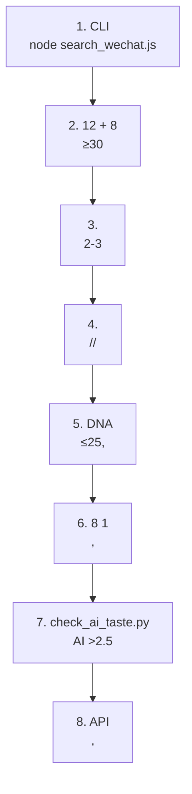

# AI 
## —— 10w+ 

> ****Meltemi-Q & 
> ****v1.0.0 
> ****https://github.com/Meltemi-Q/wechat-viral-orange-paper 

---

## *“ AI ‘ 10w+ ’”*……
****

2024 2026 
 AI 
 20~80 **“”**


 AI **“”**

 Agent Expert **“”** `wechat-official-account-expert` `viral-topic-master`
****


1. **** 15 8 1 
2. **AI ** AI 
3. ** AI ** 38 “”

Prompt
 500 

---

## - [ —— AI ](#---ai-)
- [ —— 10w+ 4 12 ](#--10w--4--12-)
- [ —— ](#--)
- [ DNA —— ](#-dna---)
- [ AI —— 38 ](#-ai---38-)
- [ —— DNA](#--dna)
- [](#)

---

## —— AI 

### 1. 


548 
- **** 30 6000+19 7547 3.8 26 6200 6.2 
- **** AI 50~100 “”


```

 ↓
 AI AI ......
 ↓
 300 
 ↓

 ↓

```

### 2. 


1. ****“”“”
2. **AI **Perplexity“…………”“…………” 85%
3. ****“”

### 3. “”


**AI **

- **AI ** 800 
- ****
 ` 2 `
- 150 ****

---

## —— 10w+ 4 12 

### 1. 4 

 80% 
 4 2 

1. ****
 “”“///”
2. ****
 “”“”“”
 “”
3. ****
 “3000”“50”“”
 
4. ****
 “”“”

### 2. 12 

 `core-principles.md` 12 

| | | | |
|---|---|---|---|
| **01** | **** | | |
| **02** | **** | “”“2000” | |
| **03** | **** | | |
| **04** | **** | “10”“”“3”“” | |
| **05** | **** | —— | |
| **06** | **** | —— | |
| **07** | **** | “” | |
| **08** | **** | | |
| **09** | **** | / 3 | |
| **10** | **** | | |
| **11** | ** 3 ** | “……” | |
| **12** | **** | “→→” AI | |

---

## —— 

### 1. 

 ** 3~5 ** 0.3 
 AI 
- [] ``
- [] `——`

### 2. 

 `wechat-title-generator` 
1. ****
 `……——` [] “”
 
 `` []
2. ****
3. ** 15 **
 4000 15 
4. **“ / ”** 30

### 3. 5 

| | | | |
|---|---|---|---|
| **** | `/IP + + ` | …… | **6.2 ** |
| **** | ` + + ` | | **3.8 (2041)** |
| **** | ` + + ` | 40008 | **** |
| **** | `…………` | | **** |
| **** | `X + ` | 50 | **** |

---

## DNA —— 

### 1. AI 

“****”
- ****“…………”
- ****
- ****

### 2. 14 

 `build_style_profile.py` 14 

```
 DNA 
 1. “”
 2. 1~3 ≤25 
 3. 
 4. 
```

### 3. DNA 

AI 

```markdown

1. 50
2. 25 3 
3. “”“”
4. “”
5. —
```

---

## AI —— 38 

### 1. 38 AI 


```
[]
× → 
× / → 
× / / → 

[]
× / → / 
× / → 
× / → 

[]
× ………… → 
× ………… → 
× ………… → 

[]
× / → 
× / → 
```

### 2. “”Adding Soul

 AI ****

1. ****
 - ``
 - ` 30 `
2. ****
 - ``
 - ``
3. ****
 - `……`
 - 

---

## —— DNA

### 1. SOP



### 2. 

 `scripts/` 

#### 1. (`search_wechat.js`)
```bash
cd scripts
# npm install cheerio

# “ ”
node search_wechat.js " " -n 10 -o trending.json
```

#### 2. DNA (`build_style_profile.py`)
```bash
# 5 
python build_style_profile.py --input-dir ../articles/
```

#### 3. AI (`check_ai_taste.py`)
```bash
# python check_ai_taste.py "posts/today_article.md"
```

---

## 1000 “”**“”**

AI 


---

# —— WeChat Skill 

> **“ AI AI ”** 
> —— 