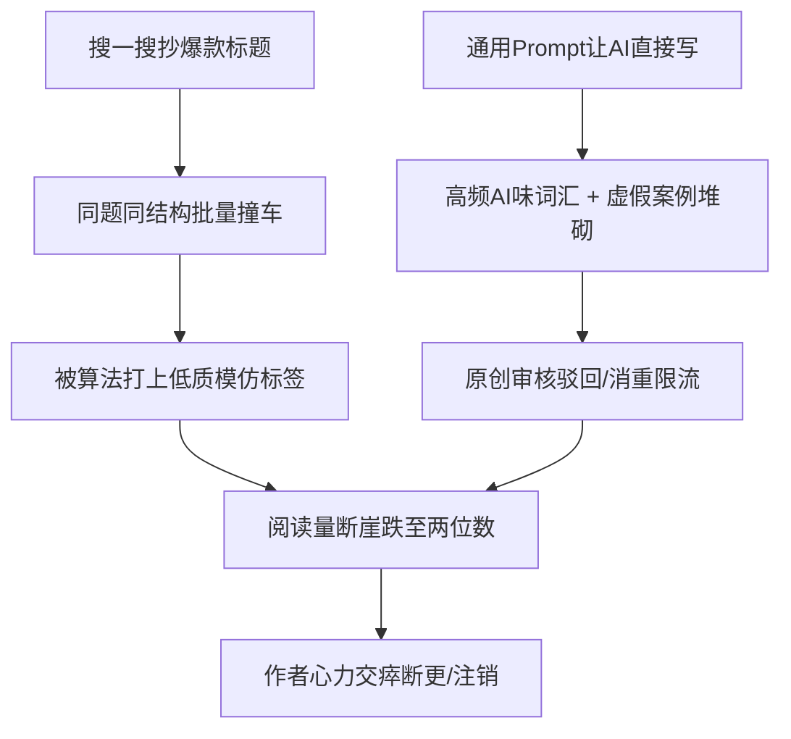
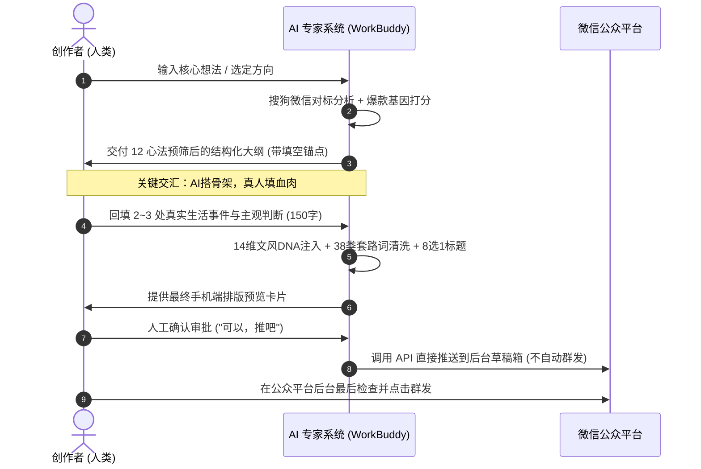
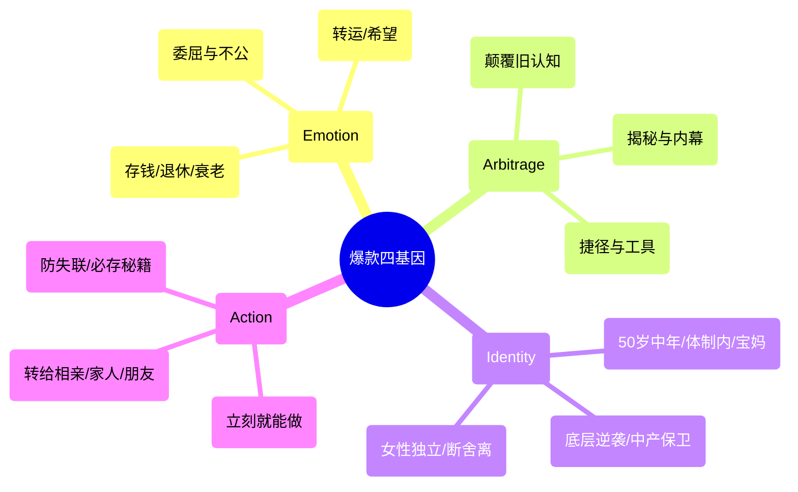
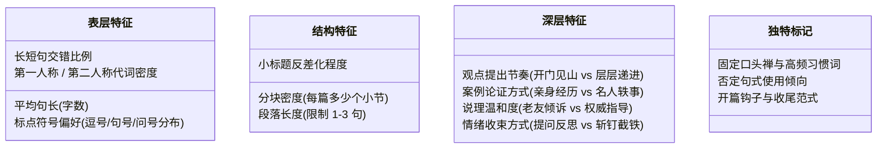
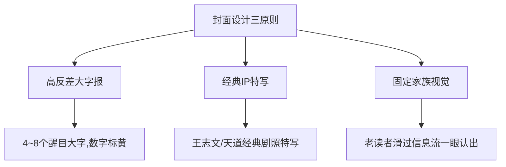

# 《公众号爆文 AI 工业化生产橙皮书》
### —— 从 WorkBuddy 专家系统到 10w+ 工业化生产线
> **版本**：v1.0.0 (Official Release)  
> **项目地址**：https://github.com/Meltemi-Q/wechat-viral-orange-paper  
> **开源协议**：Apache-2.0 License  

---

## 📖 全景目录导读

- [卷一：底层哲学与破局点 —— 为什么 AI 直出必死？](#卷一底层哲学与破局点--为什么-ai-直出必死)
- [卷二：选题工程 —— 10w+ 爆款选题炼金炉 (Viral Topic Forge)](#卷二选题工程--10w-爆款选题炼金炉-viral-topic-forge)
- [卷三：标题工程学 —— 8 选 1 严选机制与 12 大爆款公式](#卷三标题工程学--8-选-1-严选机制与-12-大爆款公式)
- [卷四：文风 DNA 建模 —— 告别千篇一律的机器腔](#卷四文风-dna-建模--告别千篇一律的机器腔)
- [卷五：去 AI 味与反蒸馏工程 (Anti-Distill & Humanizer)](#卷五去-ai-味与反蒸馏工程-anti-distill--humanizer)
- [卷六：工具链与 CLI 实践 —— 微信爆文全自动工程化](#卷六工具链与-cli-实践--微信爆文全自动工程化)

---

# 卷一：底层哲学与破局点 —— 为什么 AI 直出必死？

> “平台从来不反对创作者使用 AI 提高生产力，平台封杀和限流的，是没有灵魂、没有真人经历、模板化拼凑的批量数字垃圾。”

---

## 1. 行业现状与 AI 创作者的“死亡螺旋”

2024–2026 年，微信公众平台对内容生态的治理策略发生了根本性变革。随着大语言模型的普及，海量自媒体创作者陷入了同一个误区：
**“去搜一搜找爆款标题 → 丢给 AI 写一篇 1500 字 → 配两张网图 → 直接群发”**。

这种模式在当下的分发算法面前遭遇了彻底的降维打击：



### 死亡螺旋的三大根因：
1. **标题同质化撞车**：搜一搜排名前列的爆款标题已经被数百个号批量抄袭过，平台语义模型能够毫秒级聚类识别，直接归入“批量低质仿写库”。
2. **严重的“AI 味道”（AI Slop）**：未受约束的 LLM 天生携带“谄媚、宏大叙事、中立无立场、虚假对称感”的基因。如“在当今快节奏的社会中”、“不仅……更是……”、“让我们深入探讨一下”、“余生愿你……”。读者 3 秒内关闭，完读率低于 15%。
3. **真实生活经历的虚空**：平台算法新规明确强化了**真人实名经历特征识别**。缺乏真实生活细节（具体时间、人名、对话、数字、心理活动）的文章，无法建立读者信任与情感共鸣。

---

## 2. 破局之道：“骨架与血肉分离”的工业化范式

WorkBuddy 专家系统之所以能够持续产出爆文，核心在于彻底抛弃了“让 AI 全包代笔”的幻想，确立了**“AI 搭骨架，真人填血肉”**的共创工业化流程：



### 核心分工原则表

| 创作环节 | AI 负责什么（长板） | 人类创作者负责什么（底线） |
|---|---|---|
| **选题与切入** | 扫描全网热点、做 8 维价值打分、提供 3 个反常识切入角度 | 决定写哪个、判断是否契合自身受众与人设 |
| **框架与节奏** | 搭建起承转合骨架、设计每段字数（<25字单句）、安排高潮点 | 提供真实发生过的生活细节、具体数字、真实对话 |
| **正文初稿** | 依据文风 DNA 组装语言、阐释概念、推导逻辑链条 | 审核事实准确性、确认是否像“自己口吻说出来的” |
| **去 AI 味** | 运行硬性质检脚本，自动替换 38 类套路连词与陈词滥调 | 注入主观情绪偏见、半成品想法、口语断句留白 |
| **排版与发布** | 自动生成内联样式 HTML、生成对应封面图、直推草稿箱 | 最终点击群发，保持账号安全与合规把控 |

---

## 3. 爆款公众号的底层商业闭环

爆款文章不是目的，**健康稳定的流量主收益与私域沉淀**才是终局。

根据 548 篇爆款公众号的真实体检数据：
- **篇幅最佳区间**：`900 - 1200` 字（手机屏幕 3~4 屏，既满足当下读者碎片化耐心，又达到文中插入 2 条广告的字数门槛）。
- **生命周期规律**：微信生态中，爆文在发布后 2 小时完成公域种子池冷启动，24~48 小时由推荐算法放大。一旦单篇突破千读进大池，必须在 48 小时内同系列、同结构快速连推 2 篇进行“命中放大”。
- **单号与多号矩阵分工**：
  - **主号（流量主号）**：追求大众痛点、情绪共鸣、认知反转、高频日更，赚取流量主广告。
  - **副号（个人 IP / 转化号）**：深度私域沉淀、真实日常疗愈、高净值服务转化。


---

# 卷二：选题工程 —— 10w+ 爆款选题炼金炉 (Viral Topic Forge)

> “选题决定了一篇文章 80% 的阅读上限。写所有人都在经历的心事，不写只有自己关心的私事。”

---

## 1. 爆款四基因模型 (The Four Genes)

任何能够穿透圈层、引发病毒式转发的公众号内容，背后必然具备以下四种底层基因中的至少两项：



1. **情绪共鸣（Emotion）**：激发生理层面的情绪反应（愤怒、释怀、庆幸、危机感）。读者转发不是因为文章写得好，而是借文章说出自己想说却不敢说的话。
2. **信息差认知（Arbitrage）**：打破“常识谬误”。例如“人越节俭越穷”、“努力工作是最慢的赚钱方式”。提供高于读者日常视角的认知杠杆。
3. **身份认同（Identity）**：精准锚定群体。如“35岁裸辞”、“退休阿姨”、“月薪3000打工人”。给读者贴上清晰的归属标签。
4. **行动指令（Action）**：看完能拿去用、能发朋友圈表态、能收藏起来备查。

---

## 2. 12 心法预筛红黄线清单

在进入大纲构思前，必须用 12 条心法快速过筛，命中红线直接丢弃：

| 编号 | 心法法则 | 判定标准 | 状态 |
|---|---|---|---|
| **01** | **大众共性法则** | 是否击中数百万人的共同生存处境？（拒绝个人小情绪、日记流水账） | 🔴 核心底线 |
| **02** | **痛点清晰法则** | 能否用一句话讲清读者当前正承受的具体痛苦？ | 🔴 核心底线 |
| **03** | **反常识反转** | 核心论点是否击碎了大众既有的错误共识？ | 🟡 强力加分 |
| **04** | **具体数字锚定** | 是否包含具象量化指标？（“存到10万”优于“多存点钱”） | 🟡 强力加分 |
| **05** | **明确人群归属** | 能否在 3 秒内识别“这篇是写给谁看的”？ | 🔴 核心底线 |
| **06** | **拒绝假大空** | 是否避免了“认知重构、思维升维”等缺乏场景的空泛词？ | 🔴 核心底线 |
| **07** | **社交货币价值** | 读者分享出去后，能否彰显其“聪明、清醒、有品位”？ | 🟡 强力加分 |
| **08** | **真凭实据支撑** | 核心案例是否真实存在，或能否从真事库调取？（禁编造） | 🔴 核心底线 |
| **09** | **时效与生命力** | 是 24 小时快消热点，还是具有 3 个月长尾推荐价值？ | ⚪ 评估参考 |
| **10** | **合规红线避让** | 是否踩中政治敏感、制造极端群体对立、迷信违规等？ | 🔴 一票否决 |
| **11** | **商业转化预留** | 文末是否有自然承接广告分成或流量主卡片的空间？ | ⚪ 商业考量 |
| **12** | **系列复用潜力** | 本篇一旦爆了，同款结构能否连续衍生 3 篇以上？ | 🟡 长期资产 |

---

## 3. 8 维量化打分卡 (Scoring Card)

每一个候选选题必须由专家系统进行 8 维度打分（每项 1~5 分，满分 40 分）：

```
[选题打分结果卡]
────────────────────────────
1. 点击欲望（Title Hook）   : [ 5 / 5 ] （标题反差极强，忍不住想点）
2. 情绪张力（Emotion Tension）: [ 4 / 5 ] （击中中老年存钱恐慌）
3. 认知反差（Contrast Index） : [ 5 / 5 ] （省下的不是钱，是命）
4. 场景具体（Scene Reality）  : [ 4 / 5 ] （买菜舍不得、看病不敢花）
5. 社交货币（Social Currency）: [ 4 / 5 ] （转发朋友圈显得懂生活）
6. 完读支撑（Retention Pull） : [ 4 / 5 ] （案例递进层层剥洋葱）
7. 素材匹配（Real-story Fit） : [ 4 / 5 ] （真事库第 3、7 条完美契合）
8. 合规安全（Safety Margin）  : [ 5 / 5 ] （正面引导演变，无违规）
────────────────────────────
总分：35 分 / 40 分 【等级：核弹级（建议立即执行）】
（评级标准：≥30分合格立项，≥35分核弹级重点打造，<30分驳回重拟）
```


---

# 卷三：标题工程学 —— 8 选 1 严选机制与 12 大爆款公式

> “在订阅号信息流中，标题加上封面，就等于读者打开率的 100%。”

---

## 1. 标题筛选的四大铁律

官方专家在生成标题时，内置了极其严格的强制红线：

1. **绝对禁止冒号、破折号、引号**：
   - 错误范例：`《天道》：人到五十，这三件事千万别做——尤其是第二件！`（明显的机器营销号特征，平台重点压制）。
   - 正确范例：`《天道》丁元英早就说透了，人到五十千万别碰这三件事，尤其是第二件`。
2. **多分句强制使用逗号分隔**：信息流阅读要求单行滑读，使用逗号能带来最自然的呼吸停顿感。
3. **分发标签必须前置于前 15 个字**：
   - 微信“看一看”与公域推荐算法会抓取标题前半段的命名实体（书名、人名、经典 IP、身份）。
   - 如：`丁元英`、`《吸引力法则》`、`退休阿姨`、`存钱`。前置标签能让系统快速推送到精准兴趣人群。
4. **拒绝“如何/怎样”疑问句开头**：实测数据显示，“如何过好一生”、“怎样存下十万”平均阅读量不足 20，读者把这类标题判定为枯燥的说教教材。

---

## 2. 标题 12 大爆款公式

官方专家沉淀的 12 套高命中率标题模具：

| 公式类型 | 结构模版 | 实战案例 | 踩中人性钩子 |
|---|---|---|---|
| **公式 01** | `[经典IP/人名] + [认知反转长句]` | 丁元英：人如果过度的节俭，舍不得吃舍不得穿，那你省下来的其实不是钱 | 认知反差 / 利益 |
| **公式 02** | `[书名/概念] + [好运/转运暗示]` | 《吸引力法则》：恭喜你要转运了，否则你是看不到这篇文章的 | 好奇 / 情绪安慰 |
| **公式 03** | `[低起点身份] + [具象数字] + [实操路径]` | 月薪4000，我用这个笨办法两年存了8万 | 身份认同 / 贪婪 |
| **公式 04** | `[反常识警示] + [严重后果揭秘]` | 越是老实听话的孩子，长大后越容易在职场吃大亏 | 恐惧 / 身份共鸣 |
| **公式 05** | `[具体年龄/阶段] + [生活真相反转]` | 过了 50 岁才明白，真正能依靠的从来不是儿女和老伴 | 危机感 / 现实痛点 |
| **公式 06** | `[大众痛点场景] + [心理学解药]` | 为什么你总是不好意思拒绝别人，心理学上的讨好陷阱害苦了你 | 解释性 / 救赎感 |
| **公式 07** | `[极小行动] + [极大杠杆对比]` | 每天睡前花 3 分钟做这件小事，一年后你的思维方式会彻底拉开差距 | 懒惰 / 利益激励 |
| **公式 08** | `[权威名言借力] + [当代生活落地]` | 曾国藩说的大聪明人往往命薄，其实说的就是今天我们身边的这类人 | 好奇 / 社交评判 |
| **公式 09** | `[否定旧方法] + [给出新捷径]` | 别再盲目逼自己早起了，掌握了精力管理的底层逻辑你根本不需要熬 | 释怀 / 懒惰 |
| **公式 10** | `[具象困境] + [打破思维局限]` | 工资太低的时候，你必须做好这3件事，极限存到10w | 行动指令 / 搞钱 |
| **公式 11** | `[直戳隐秘情绪] + [卸下包袱]` | 允许自己偶尔不优秀，是治愈一切内耗最快的方式 | 情绪疗愈 / 共鸣 |
| **公式 12** | `[时间跨度] + [实证结果复盘]` | 坚持记账三年之后，我的人生究竟发生了哪些意想不到的变化 | 真实性 / 好奇心 |

---

## 3. 专家系统的 8 选 1 输出机制

在每篇文章成型时，专家会自动产出 8 个候选标题，并强制覆盖 4 类风格，最后给出明确的裁决决策：

```markdown
### 候选标题池（8 选 1）
1. [反差型] 丁元英早就看穿了，那些天天喊着节俭的人，往往一辈子都发不了财
2. [情绪型] 看了丁元英这句话我才恍然大悟，原来很多苦真的是我们自己找的
3. [承诺型] 读透《天道》里的这一招，教你在低谷期逆风翻盘
4. [认知型] 缺钱的本质从来不是能力不行，而是你还没搞懂价值交换的规律
5. [备选 A] 丁元英：人如果过度节俭，省下的其实不是钱而是自己的前途
6. [备选 B] 为什么很多人越省越穷，天道里给出的答案让人脊背发凉
7. [备选 C] 真正聪明的中年人，从来不在吃穿用度上过分为难自己
8. [备选 D] 读懂了丁元英的生存法则，你才能少走二十年的人生弯路

### 推荐决策
- **最优推荐（主推）**：第 1 条（理由：前置丁元英分发标签，反差极其剧烈，自然激发点击与评论区辩论）。
- **更稳妥版本**：第 5 条（适合调性更温和、不想引发过大争议的场景）。
- **更强传播版本**：第 6 条（利用极端情绪张力，适合冲刺大公域推荐池）。
```


---

# 卷四：文风 DNA 建模 —— 告别千篇一律的机器腔

> “读者关注一个公众号，不是为了看一部百科全书，而是为了跟一个有血有肉、有脾气性格的活人保持长期的精神连接。”

---

## 1. 14 维文风 DNA 分析框架 (Style DNA Framework)

WorkBuddy 专家系统将一个作者的写作风格拆解为四层共 14 个维度的显式参数：



---

## 2. Python 文风量化提取脚本机制 (`build_style_profile.py`)

专家系统通过对作者历史 3~10 篇爆款原文运行量化脚本，直接提取出客观数据底盘：

```python
# scripts/build_style_profile.py 核心算法节选
def analyze_style(text):
    sentences = re.split(r"[。！？!?]+", text)
    avg_sentence_len = mean([len(s) for s in sentences if s.strip()])
    
    # 人称代词比例检测
    you_count = len(re.findall(r"你|你们", text))
    we_count = len(re.findall(r"我们", text))
    i_count = len(re.findall(r"我|自己", text))
    
    # 标点符号与否定结构检测
    em_dash_count = len(re.findall(r"[—–]", text))  # 破折号（AI典型标记）
    banned_not_but = len(re.findall(r"不是.*而是", text)) # 典型虚假对称句
    
    return {
        "avg_len": avg_sentence_len,
        "second_person_ratio": you_count / len(sentences),
        "fatal_ai_patterns": em_dash_count + banned_not_but
    }
```

---

## 3. 落地实操：文风 DNA 配置文件示例

为公众号作者生成的标准文风配置文件（可直接被 Prompt 引用）：

```markdown
# 作者文风 DNA 规范卡（示例：退休成熟知识博主）

## 1. 基础语调与人设
- **身份设定**：50岁左右退休大姐，心态开阔，阅历丰富，像老姐妹在茶室面对面聊天。
- **对话感**：全文使用“你”与“我”，高频互动（“你想想是不是这个理？”）。
- **情绪底色**：温和、包容但一针见血，不贩卖恐慌，不打鸡血。

## 2. 段落与标点配方
- **段落长度**：严格控制在 1~3 句话以内，在手机端显示绝不超过 4 行。
- **标点约束**：全篇禁用破折号（—），疑问句每篇 ≤4 处，句号与逗号为主。
- **金句节奏**：每 300 字必有一句独立成段的穿透性总结。

## 3. 绝对禁用
- 严禁年轻网络黑话（如“破防了”、“绝绝子”）。
- 严禁学术会议报告腔（如“由此可见”、“毋庸置疑”）。
- 严禁结尾使用“愿你……不负余生”等俗套祝词。
```


---

# 卷五：去 AI 味与反蒸馏工程 (Anti-Distill & Humanizer)

> “机器生产的内容最致命的缺陷不是逻辑漏洞，而是‘过度完美’。人类的语言天生带着情绪的偏见、思维的跳跃与呼吸的停顿。”

---

## 1. 38 类高频 AI 套路词清洗黑名单

所有专家初稿必须经过双重过滤器（`humanizer` 灵魂注入 + `anti-distill` 词汇清洗），以下词汇一旦出现强制清除替换：

| 类别 | 严禁出现的 AI 典型高频套路词 | 为什么被平台识别为 AI？ | 人类自然表达替换方案 |
|---|---|---|---|
| **宏大叙事类** | 在当今快节奏的社会中、纵观历史长河、时代的浪潮、画卷、不可逆转的趋势 | 缺乏具体场景，大模型空转时的典型填充语 | 直接切入具体日子：`那天下午我和老张吃饭……` |
| **虚假深入类** | 深入探讨、拨开迷雾、探寻底层的逻辑、剖析本质、解构 | 装模作样的学术腔，读者反感 | 替换为大白话：`聊聊这件事到底怎么回事` |
| **生硬连接类** | 值得注意的是、总而言之、由此可见、不仅如此、换言之、毋庸置疑 | 逻辑连词过度密集，人类口语绝不这样说话 | 直接删掉连词，依靠分段自然转换语义 |
| **虚假对称类** | 不是……而是……、既是……又是……、不仅能……更能…… | 大模型贪恋平仄对仗，导致文本极其做作机械 | 拆成单句，先说结论，再说感受 |
| **廉价感叹类** | 震撼了心灵、敲响了警钟、让人深思、发人深省、掀起轩然大波 | 情绪注水，用抽象形容词代替实际震撼 | 讲一个真实细节，让读者自己得出感受 |
| **俗套鸡汤类** | 愿你历尽千帆、不负韶华、不念过往不畏将来、余生愿你平安喜乐 | 自媒体烂俗模板，消重算法直接判定为垃圾营销 | 真实嘱咐：`今天降温了，出门多穿件外套` |

---

## 2. 真实瑕疵与“灵魂注入术” (Adding Soul)

去 AI 味的后半程不是做“减法”，而是做“加法”——注入人类作者特有的**思维痕迹与情绪瑕疵**：


### 灵魂注入的三大实操技巧：
1. **拥有鲜明的主观偏见（Have Opinions）**：
   - ❌ AI 中立腔：`关于中年存钱，有人认为该节俭，有人认为该消费，各有道理。`
   - ✅ 真人态度：`我直接说句可能会挨骂的话：人过四十要是手里没五万块应急钱，其他的道理全都是废话。`
2. **打碎匀速节奏（Vary Your Rhythm）**：
   - 短句连打。停顿。然后是一段慢条斯理、娓娓道来的生活描写。最后再来一句单字断句。
3. **引入不经意的生活边角料（Imperfection）**：
   - 在严肃道理中突然插入一句：`（昨天晚上我那小孙子又在客厅闹腾，差点把这篇稿子给删了）`。一句真实生活花絮，AI 味瞬间归零。

---

## 3. Python 自动化检测工具 (`check_ai_taste.py`)

本地运行脚本能够对文章进行 0~5 分的 AI 味评分（>2.5 分直接拦截禁止进入草稿箱）：

```python
# 运行方式：
# python scripts/check_ai_taste.py "posts/article.md"
# 输出报告：
# 发现 4 处禁用套路词汇，未检测到未填空锚点，当前 AI 味指数：1.8（合格）
```


---

# 卷六：工具链与 CLI 实践 —— 微信爆文全自动工程化

> “真正的生产力革命，是用自动化流水线解放人类机械劳动，将创作者的精力 100% 聚焦在核心决策与人生体验上。”

---

## 1. 微信公众平台爆文对标爬虫 (`search_wechat.js`)

专家内置了独立的 Node.js 微信文章检索工具，通过搜狗微信搜索通道抓取全网真实数据：

```bash
# 进入脚本目录
cd scripts

# 基础搜索（获取最新10篇相关热文）
node search_wechat.js "天道 存钱" -n 10

# 保存到 JSON 供分析
node search_wechat.js "吸引力法则 转运" -n 20 -o trending_topics.json
```

### 技术实现要点：
- **随机 User-Agent 池**：内置 20 个不同平台（Mac、Win、iOS、Android）浏览器指纹轮换，杜绝单一指纹拦截。
- **自动解压支持**：适配 Gzip、Deflate、Brotli 等多种 Content-Encoding 响应。
- **输出结构化字段**：标题、摘要、来源公众号、发布时间、中间跳转链接。

---

## 2. 封面图设计哲学：打开率的另一半

在微信订阅号信息流中，读者决策是否点击仅需 0.5 秒。封面图的核心原则是：**不追求过度艺术化，追求小图里的视觉冲突**。



- **尺寸规范**：推荐主图 `900 × 383`（大图展示），同时必须保证正方形裁切预览图（`square_preview.png`）中关键文字完全居中不被裁切。
- **图文配合公式**：
  - 天道系列：深色王志文人物特写 + 醒目黄色反转大字。
  - 存钱系列：白底极简大红字，直接突出具体金额（如“10万”）。
  - 吸引力法则系列：暖金星空意境底图 + 居中好运暗示文案。

---

## 3. 自动化闭环：直接推送到微信后台草稿箱 (`mp-draft-push`)

官方专家采用微信公众平台官方 Draft API，打通最终发布链路：

```bash
# 环境变量配置
export WECHAT_APPID="wx1234567890abcdef"
export WECHAT_SECRET="your_secret_here"

# 推送命令（输入正文 HTML 与封面图路径）
./scripts/push_draft.sh --title "标题" --cover "cover.png" --content "article.html"
```

> **安全红线**：系统永远只调用草稿箱推送接口（`draft/add`），**绝对不直接调用群发接口（freepublish）**。每篇文章必须保留创作者在手机端或 PC 后台亲眼预览、亲手点击群发的最后一道防线！


---

## 附录：核心资产与代码索引

本橙皮书所配套的全部工业级可运行代码均已存入仓库：
- **`skills/wechat-official-account-expert/`**：官方微信专家完整配置、Agent 提示词与 8 大技能。
- **`skills/viral-topic-master/`**：10w+ 选题炼金炉全部规则与评分参考表。
- **`scripts/search_wechat.js`**：微信文章真实搜索对标爬虫（Node.js CLI）。
- **`scripts/build_style_profile.py`**：14 维文风 DNA 量化提取与建模器（Python CLI）。
- **`scripts/check_ai_taste.py`**：AI 味与禁用词拦截自检工具（Python CLI）。
- **`templates/`**：标题评分表、选题打分卡、文风 DNA 标准模版。
